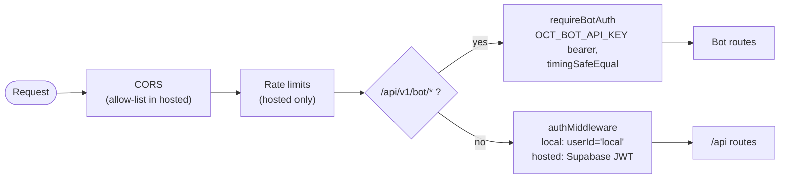

There are three distinct auth surfaces, applied in this middleware order
(`backend/src/index.ts`) — the bot router mounts **before** the user-auth
`/api` router:

## User auth (`/api/*`)

`backend/src/auth/middleware.ts` sets `req.userId` for every request:

| Mode | Behavior |
| --- | --- |
| **Local** | No auth at all. Every request gets `req.userId = 'local'`. This is why local mode binds `127.0.0.1` — the API serves Discord tokens and Telegram session strings. |
| **Hosted** | Requires `Authorization: Bearer <supabase-jwt>`. Verified with `supabase.auth.getUser(token)`; `req.userId` becomes the Supabase user id. Failures return `401`. |

One deliberate exception: `GET /api/portfolio/status` bypasses auth entirely —
it is a provider-env probe that returns no secrets.

Frontend side: there is no single API client. `apiFetch` (in
`frontend/src/stores/appStore.ts`) plus per-hook `portfolioFetch` /
`fomoFetch` each attach the bearer token via shared primitives in
`frontend/src/lib/supabase.ts` (`getAccessToken`, `authHeaders`). Some hooks
(`useTrackedWallets`, `useHoldingWallets`, `useFomoTracking`) skip the backend
and read/write Supabase directly under RLS.

## Bot API (`/api/v1/bot/*`)

`backend/src/auth/botAuth.ts` — machine auth only:

- `Authorization: Bearer <OCT_BOT_API_KEY>`, compared with `timingSafeEqual`.
- `503` when `OCT_BOT_API_KEY` is unset on the server; `401` on mismatch.
- Never touches Supabase. User scoping happens only via the
  `X-Discord-User-Id` header on the endpoints that need it, resolved to an
  OCT user through the `SECURITY DEFINER` function
  `oct_user_id_by_discord_id` (Discord OAuth identity link).

## WebSocket (`/ws`)

No auth is required to **open** the socket. In hosted mode the client must
send an `auth` frame with the Supabase access token before it receives any
user-scoped frames; in local mode the auth frame is ignored and every socket
receives everything. See [WebSocket protocol](../websocket/).

## Rate limits (hosted mode only)

| Limiter | Window | Max | Applies to |
| --- | --- | --- | --- |
| Auth | 15 min | 30 | `/api/auth/*` (includes `/api/auth/telegram/*`) |
| General | 60 s | 300 | all of `/api` (skips the missed-runner test POST) |
| Missed-runner test | 60 s | 12 (per user) | `POST /api/alerts/missed-runner/test` — **both modes** |

Also hosted-only: `trust proxy`, helmet (CSP off), CORS restricted to
`ALLOWED_ORIGINS`.

## Token storage at rest

Hosted mode encrypts Discord tokens and Telegram credentials/sessions with
AES-256-GCM (`backend/src/auth/encryption.ts`, key = `TOKEN_ENCRYPTION_KEY`,
64 hex chars). Local mode stores plaintext JSON — acceptable only because
local mode is loopback-bound and single-user.

:::note
In hosted mode the backend **does not store Discord user tokens at all** for
gateway purposes — the Discord user gateway runs in the browser and the token
stays client-side ([ADR-002](../../adr/002-browser-gateway/)). The encrypted
`discord_tokens` table exists for legacy/API-surface parity; `POST
/api/auth/token` in hosted mode returns `{ clientGateway: true }` and stores
nothing.
:::
