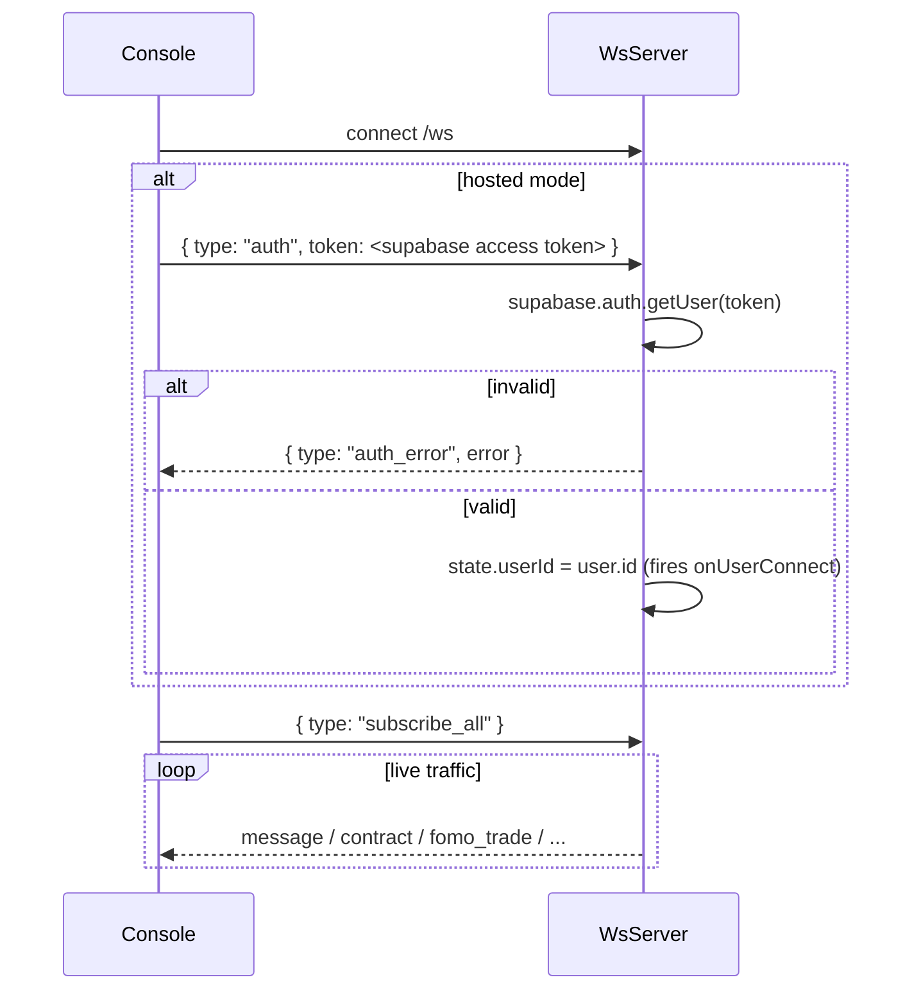

Implementation: `backend/src/ws/server.ts` (`WsServer`). Client:
`frontend/src/hooks/useWebSocket.ts`.

## Connection & handshake

- URL: `ws(s)://<api-host>/ws` — attached to the same HTTP server as the REST
  API. In hosted deployments that is the **Railway** host (WebSockets don't
  run on Vercel).
- No auth is required to open the socket. Malformed JSON frames are ignored.
- The client auto-reconnects 3 s after close. There is no server heartbeat.

Delivery rule (`shouldSendToClient`): in hosted mode a frame carrying a
`userId` only reaches sockets authenticated as that user; then the socket
must be subscribed to `__all__` or a matching room. **Room filtering applies
only to `message`, `message_update`, and `message_delete`** — every other
frame type is user-filtered but not room-filtered.

In local mode sockets never authenticate; `sendToUser` falls back to
broadcasting to every connected socket.

## Client → server frames

| `type` | Payload | Purpose |
| --- | --- | --- |
| `auth` | `{ token }` | Authenticate with a Supabase access token (hosted only; ignored in local mode). |
| `subscribe` | `{ roomId }` | Add a room to this socket's set. |
| `unsubscribe` | `{ roomId }` | Remove it. |
| `subscribe_all` | — | Subscribe to the `__all__` wildcard (the console always does this). |

## Server → client frames

| `type` | Payload (shape) | Meaning |
| --- | --- | --- |
| `auth_error` | `{ error }` | Token verification failed. |
| `message` | `{ data: FrontendMessage, roomIds }` | New Discord/Telegram message. Room-filtered. |
| `message_update` | `{ data: { messageId, channelId, embeds?, content?, … }, roomIds }` | Message edited. Room-filtered. |
| `message_delete` | `{ data: { messageId, channelId }, roomIds }` | Message deleted. Room-filtered. |
| `alert` | `{ data: { type, message, reason } }` | Toast alert. Inner `type` ∈ `highlighted_user`, `contract_address`, `keyword_match`, `missed_runner` (plus a client-only `signal_convergence`). Also fans out to `onAlert` listeners — the seam the OCT bot uses for DM delivery. |
| `reaction_update` | `{ data: { channelId, messageId, emoji, delta } }` | Reaction count changed. |
| `contract` | `{ data: ContractEntry }` | New contract detected and logged. |
| `contract_enrichment` | `{ data: ContractEntry }` | Token metadata attached to a logged contract. |
| `chain_update` | `{ data: { address, evmChain } }` | EVM chain resolved for an address. |
| `gateway_ready` | `{ data: { username } }` | Discord gateway connected — client refetches guilds/DMs/history. |
| `gateway_auth_failed` | `{ error, tokenIndex, tokenInvalid, tokenBlocked }` | A Discord token failed auth, or the IP is blocked. |
| `telegram_ready` | `{ data: { username, firstName } }` | Telegram connected — client refetches chats/history. |
| `fomo_trade` | `{ data: { fomoUserId, fomoHandle, side, tokenAddress, tokenSymbol, tokenName, marketCap, marketCapDisplay, networkId, usdValue, tradeId, notify } }` | A tracked trader's trade, delivered per-user via `sendToUser`. `tokenName`/`marketCap` are resolved from the token catalog (same enrichment as contract calls), not from FOMO's own payload — null until resolved. `notify` is true only for a live dispatch to a subscriber with `notify_pushover` on; backfill/replay always sets it false so reconnecting or newly tracking a trader can't fire a burst of toasts. |

New frame types enter through two escape hatches only: `broadcastRaw(msg,
userId?)` (used for the `*_ready` / auth-failure frames) and
`sendToUser(userId, msg)` (used for `fomo_trade`).

## Interaction with the browser Discord gateway

When the hosted console runs its own in-browser Discord gateway,
`useWebSocket` sets `skipDiscordWs` and **ignores Discord-originated frames**
from the backend, while still consuming Telegram, FOMO, enrichment, and alert
frames. The two transports are mutually exclusive for Discord, complementary
for everything else. See [Frontend architecture](../../architecture/frontend/).

## Lifecycle side-effects

`WsServer.setUserLifecycleCallbacks(onConnect, onDisconnect)` lets hosted
mode refcount per-user Discord gateways in the `UserGatewayPool`: a
successful `auth` frame marks the user active; socket close decrements. The
poller also uses `getAuthenticatedClientCount()` to adapt its FOMO poll rate
(10 s with clients connected, 60 s idle).
