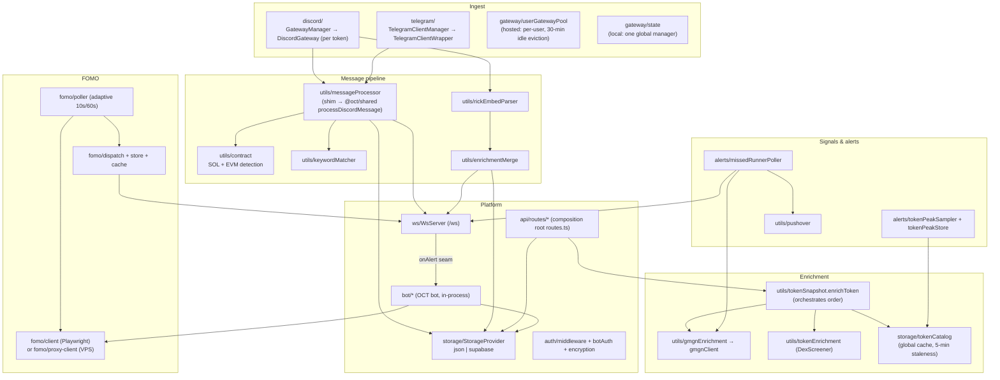
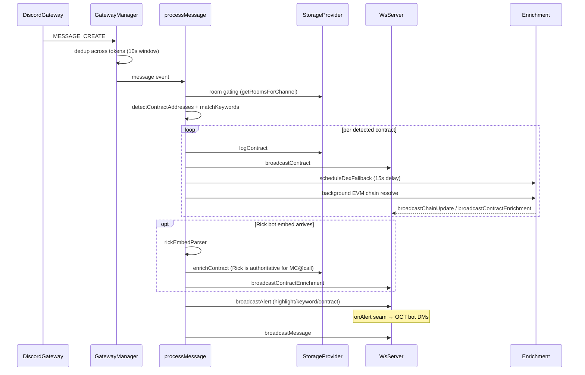
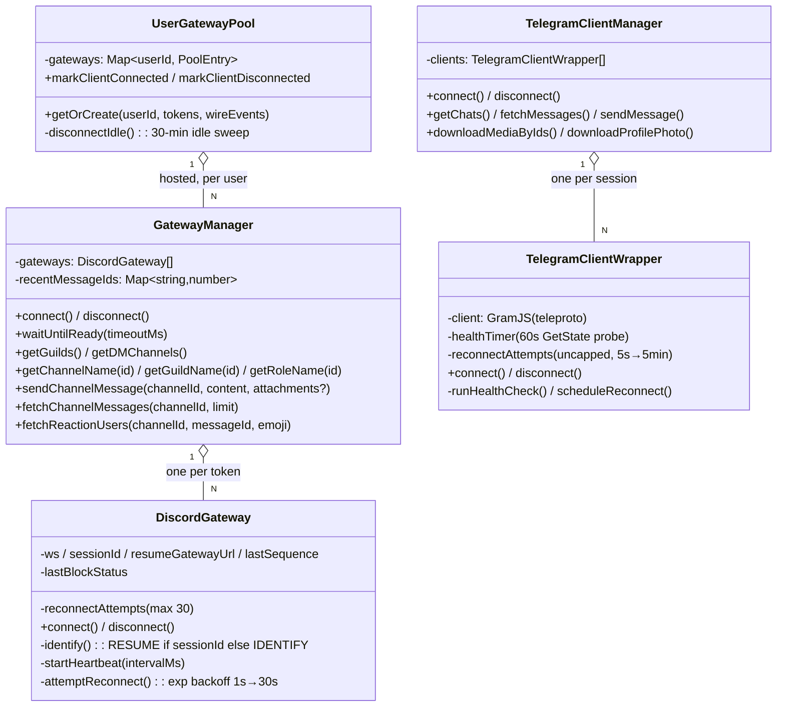
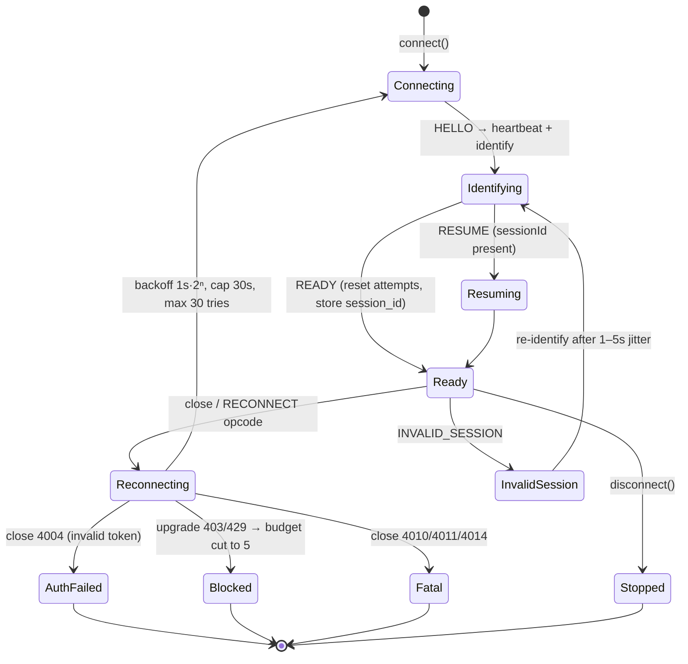
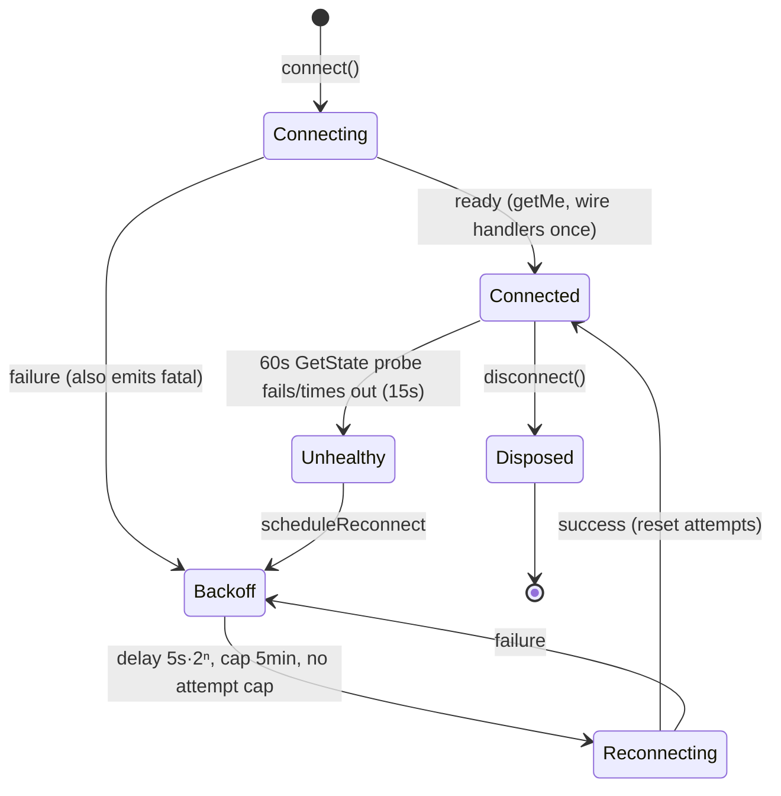

Entry: `bootstrap.ts` (preflight only) → `index.ts` (the real app). This page
is the C4 component view of the Railway container plus the class/state
diagrams for its stateful parts.

## Component diagram

## The ingest pipeline (sequence)

The exact order for a Discord message in local mode (Telegram is identical
minus the Rick step):

In **hosted mode** the browser gateway performs detection client-side and
posts results to `POST /api/contracts` / `POST /api/contracts/rick-enrich`,
after which the server-side flow (enrichment, broadcast, catalog) is the same.

## Gateway classes

Backend and frontend deliberately mirror each other — the browser twin is a
near line-for-line port:

Both managers dedup across their children (10 s window, 5000-entry cap;
Discord keys on message id, Telegram on `chatId:messageId`) and expose a
best-effort readiness barrier (`waitUntilReady` resolves on timeout rather
than rejecting).

## Connection lifecycles (state machines)

### Discord gateway

Notes: heartbeat ACKs are **not** tracked (no zombie detection — Discord must
close the socket); the browser twin lacks the 403/429 block fast-fail because
the browser WebSocket API can't see the failed upgrade response.

### Telegram client

The health probe exists because teleproto can silently drop the update stream
while reporting connected — the socket looks fine, messages just stop.
Handlers are wired once (`handlersWired`) so a reconnect can't duplicate
messages. Unlike Discord there is no give-up state: it retries forever at a
5-minute ceiling.

### Hosted per-user pool

`UserGatewayPool.getOrCreate` fingerprints the token list (first 8 chars of
each, sorted). Same fingerprint → reuse; different → tear down and rebuild.
`WsServer` lifecycle callbacks refcount active sockets per user; a 60 s sweep
evicts entries with zero clients idle past 30 minutes.

## Enrichment provider split

Deliberate and easy to get wrong — see [ADR-003](../../adr/003-provider-split/):

| Provider | Used for | Never used for |
| --- | --- | --- |
| **GMGN** (`gmgnEnrichment` → `gmgnClient`) | token enrichment + missed-runner live MC (only when `GMGN_API_KEY` set) | portfolio |
| **DexScreener** (`tokenEnrichment`) | symbol/metadata fallback | — |
| **Birdeye** (`portfolio/`) | portfolio only (stats/PnL/holdings/activity) | enrichment |

`enrichToken` (`utils/tokenSnapshot.ts`) enforces the GMGN → DexScreener
order and persists results to the token catalog. `mergeEnrichmentPatch`
(`utils/enrichmentMerge.ts`) makes Rick-embed data authoritative for
MC-at-call: a Rick patch overrides a fallback's FDV; any other source only
fills gaps.
