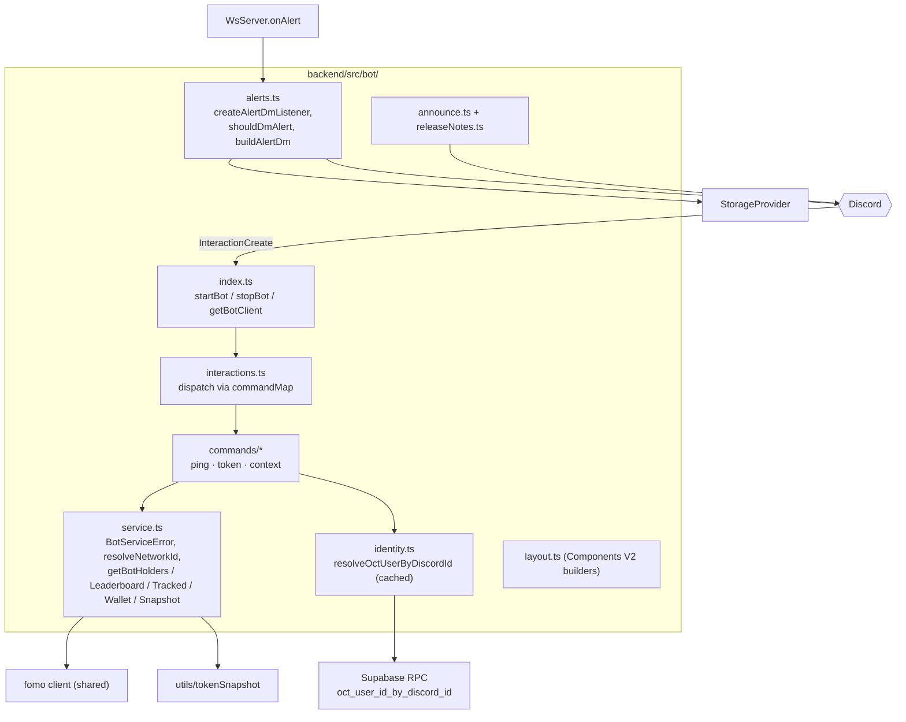
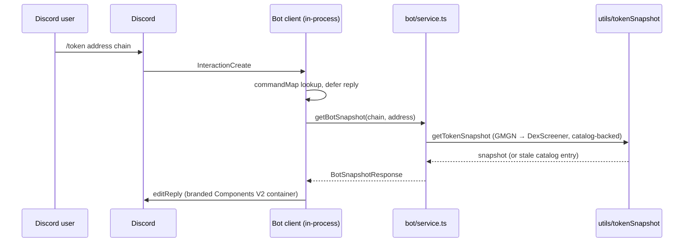

The bot runs **in-process with the backend** ([ADR-006](../../adr/006-in-process-bot/)):
command handlers call `bot/service.ts` directly — no HTTP hop, no second
deploy target. It self-gates on `DISCORD_BOT_TOKEN` and swallows every
failure path, so a bot problem can never take down feed ingestion, the API,
or the WS.

Intents: `Guilds` only — slash commands, no message content, no privileged
intents.

:::note[The FOMO commands are retired]
`/holders`, `/leaderboard`, `/tracked` and `/wallet` were removed once the
console reached parity (contract-row holders drawer, Workspace token lookup,
Wallets → Trader Lookup, and the existing FOMO leaderboard + tracker). The
surviving commands are `/ping` and `/token`, the latter reading OCT's own
enrichment catalog rather than FOMO.

**The bot itself is unaffected** — DM alerts, release notes and the announce
API all continue. `bot/service.ts` keeps `getBotHolders`/`getBotWallet`/
`getBotLeaderboard`/`getBotTracked`: the `/api/v1/bot` routes still expose
them, and the console's `/api/fomo/hodlers/top` + `/api/fomo/wallet` are built
on the first two.
:::

## Component view

## Slash command flow

Errors map through `BotServiceError` codes (`not_configured`, `upstream`,
`not_found`, `not_linked`) to friendly ephemeral replies; the stale
"Unknown interaction" (10062) is silently dropped.

## Tenancy

The bot is DM-first and multi-tenant-aware: a Discord user maps to an OCT
account via the Supabase **Discord OAuth identity** — the `SECURITY DEFINER`
function `oct_user_id_by_discord_id` reads `auth.identities` (service-role
only, cached in `identity.ts`), returning `not_linked` when a Discord account
has no linked OCT login.

No surviving slash command needs user data — `/tracked` was the only one, and
it retired with the other FOMO commands. The mapping still backs alert-DM
delivery and `GET /api/v1/bot/fomo/tracked`.

## Alert DMs (opt-in)

`startBot(wsServer)` subscribes `createAlertDmListener` to the
`WsServer.onAlert` seam — the single integration point, chosen so no alert
emission site needed changes. Delivery is gated per user by
`discordBotDm` config (master switch AND per-trigger:
`highlighted_user`, `contract_address`, `keyword_match`, `missed_runner`,
`releaseNotes`) — all **off by default**. Release-notes DMs additionally
walk opted-in users sequentially with a 600 ms floor gap, retry-after
handling, and a 2000-recipient cap.

## Announce API

`POST /api/v1/bot/announce` (bot-key auth) renders a branded announcement in
`DISCORD_ANNOUNCE_CHANNEL_ID` through the in-process client, optionally
DMing release-notes opt-ins (`dmOptIns`, default false — a CI push can never
DM). This is what the [changelog workflow](../../operations/announcements/)
calls.

## pump.fun callout posts (opt-in, public)

`backend/src/pumpfun/calloutDiscord.ts` reposts pump.fun callouts into
`OCT_CALLOUT_DISCORD_CHANNEL_ID` using the same connected client and the same
Components V2 idiom — no webhook, no second login, no new secret. It hangs off
the callout poller **after** the existing WS + Pushover delivery, so a Discord
fault can neither delay nor break either.

Three properties are structural:

- **One post per callout, not per subscriber.** The poller's follower fan-out
  loops per (callout × follower); this path is driven from the poller's `fresh`
  list, already deduped by `calloutId` against the persisted cursor. A bounded
  in-process `SeenCallouts` covers the one gap the cursor can't: a poll that
  posted and then failed to write the cursor.
- **The follow graph stays private.** `pump_tracked_callers` is never read here.
  The channel's caller set is operator-controlled only — the
  `OCT_CALLOUT_DISCORD_CALLERS` allowlist, else OCT's global Top Callers board
  (itself built from the public firehose). Callout *content* is public pump.fun
  data; who-follows-whom is not.
- **Flood protection is a hard cap, not a queue.** `PostBudget` admits at most
  `OCT_CALLOUT_DISCORD_MAX_PER_WINDOW` posts per rolling window; the rest are
  dropped (a queued callout is stale by the time it lands), counted in a log
  line, and summarised as "+N more callouts held back" on the next post through.

Default **OFF** — see the [environment reference](../../operations/environments/).

## Command registration

Slash commands are registered out-of-band with
`npm run bot:deploy -w backend` (`bot/deployCommands.ts`) — instant to
`DISCORD_DEV_GUILD_ID` when set, `-- --global` for global rollout.

The script `PUT`s the whole `commands` array, which replaces the registered
set rather than merging into it. **Removing a command from
`commands/index.ts` is therefore only half the job** — until `bot:deploy`
runs, Discord still advertises it and users get "application did not respond"
on a handler that no longer exists. Global propagation can take up to an hour.

:::note[Hosting]
The bot lives wherever the backend runs with `DISCORD_BOT_TOKEN` set — in
production that is the Railway backend. The variable being unset simply
disables the bot; everything else runs unchanged.
:::
