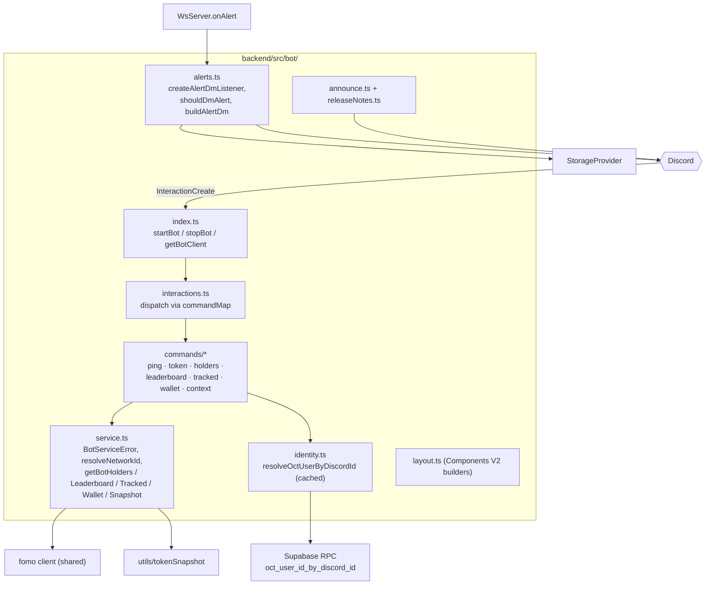
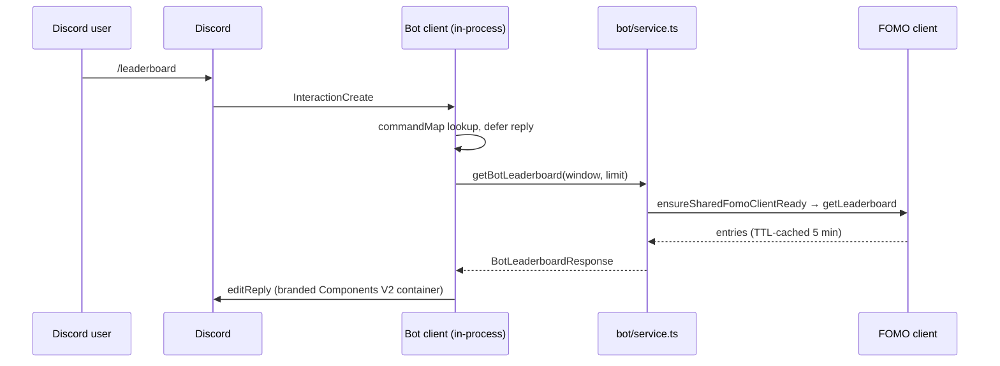

The bot runs **in-process with the backend** ([ADR-006](../../adr/006-in-process-bot/)):
command handlers call `bot/service.ts` directly — no HTTP hop, no second
deploy target. It self-gates on `DISCORD_BOT_TOKEN` and swallows every
failure path, so a bot problem can never take down feed ingestion, the API,
or the WS.

Intents: `Guilds` only — slash commands, no message content, no privileged
intents.

## Component view

## Slash command flow

Errors map through `BotServiceError` codes (`not_configured`, `upstream`,
`not_found`, `not_linked`) to friendly ephemeral replies; the stale
"Unknown interaction" (10062) is silently dropped.

## Tenancy

The bot is DM-first and multi-tenant-aware: a Discord user maps to an OCT
account via the Supabase **Discord OAuth identity** — the `SECURITY DEFINER`
function `oct_user_id_by_discord_id` reads `auth.identities` (service-role
only, cached in `identity.ts`). Commands that need user data (`/tracked`)
return `not_linked` if the Discord account has no linked OCT login.

## Alert DMs (opt-in)

`startBot(wsServer)` subscribes `createAlertDmListener` to the
`WsServer.onAlert` seam — the single integration point, chosen so no alert
emission site needed changes. Delivery is gated per user by
`discordBotDm` config (master switch AND per-trigger:
`highlighted_user`, `contract_address`, `keyword_match`, `missed_runner`,
`releaseNotes`) — all **off by default**. Release-notes DMs additionally
walk opted-in users sequentially with a 600 ms floor gap, retry-after
handling, and a 2000-recipient cap.

## Announce API

`POST /api/v1/bot/announce` (bot-key auth) renders a branded announcement in
`DISCORD_ANNOUNCE_CHANNEL_ID` through the in-process client, optionally
DMing release-notes opt-ins (`dmOptIns`, default false — a CI push can never
DM). This is what the [changelog workflow](../../operations/announcements/)
calls.

## Command registration

Slash commands are registered out-of-band with
`npm run bot:deploy -w backend` (`bot/deployCommands.ts`) — instant to
`DISCORD_DEV_GUILD_ID` when set, `-- --global` for global rollout.

:::note[Hosting]
The bot lives wherever the backend runs with `DISCORD_BOT_TOKEN` set — in
production that is the Railway backend. The variable being unset simply
disables the bot; everything else runs unchanged.
:::
