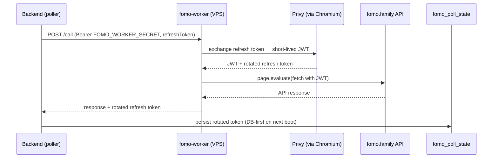

fomo.family sits behind Cloudflare bot protection, so its API can't be called
from a datacenter container with plain `fetch` — calls must originate from a
real stealth Chromium page. That is the entire reason this workspace exists
([ADR-005](../../adr/005-fomo-worker/)).

```
Railway (oct-backend)  ──HTTP + secret──►  VPS (fomo-worker)  ──browser──►  fomo.family API
```

## Two client implementations, one interface

`FomoClientLike` has two drop-in implementations; `ensureSharedFomoClient()`
picks one:

| | `FomoClient` (in-process) | `FomoProxyClient` (proxy) |
| --- | --- | --- |
| Where Chromium runs | inside the backend (Playwright + stealth) | on the VPS worker |
| Selected when | default | `FOMO_PROXY_URL` + `FOMO_WORKER_SECRET` set (`isFomoProxyMode()`) |
| Used in production | — | ✔ (Railway → VPS) |

Both expose the same surface: `call`, `searchUsers`, `getUserByHandle`,
`getUserBalances`, `getLeaderboard`, `getUserActivity`, `getTokenTheses`, …

## Token rotation

Auth against fomo.family is a Privy refresh token exchanged for short-lived
JWTs. Rotation is persisted so a restart never needs a fresh manual login:



Bootstrap: seed `fomo_poll_state.refresh_token` once (SQL) or set
`FOMO_REFRESH_TOKEN` for first boot; after that the poller reads DB-first and
auto-rotates.

## Deployment

- VPS: Vultr box, `deploy/setup-vps.sh` installs Node 20, deps, Playwright
  Chromium, and a systemd unit (`fomo-worker.service`), serving
  `http://<vps>:3100`.
- Health probe: `GET /health` (curl it locally on the box).
- The full repo is cloned at `/opt/onchain-tools`; only
  `fomo-worker/` runs there. `dist/` is gitignored; `src/` is tracked.
- Auth: every request requires the shared `FOMO_WORKER_SECRET`.

## Caching & rate shape

`fomo/cache.ts` (backend side): leaderboard 5 min TTL, hodlers 15 min TTL
(env-overridable). The poller polls each unique tracked trader once per
cycle regardless of subscriber count, at an adaptive 10 s / 60 s interval.
