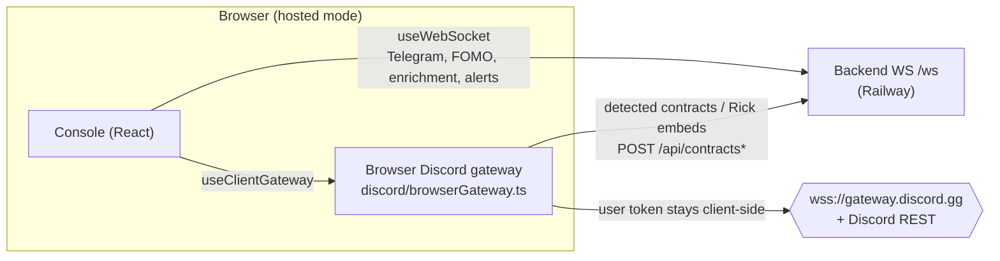

Entry chain: `main.tsx` (pre-paint `initTheme()`; renders `PopoutView` if
`?popout=1`, else `App`) → `App.tsx` (`BrowserRouter`, base `/dashboard/`,
all pages lazy) → `AppProviders.tsx` (boots `useWebSocket`,
`useClientGateway`, `useSignalConvergence`, auth session, initial data
loads) → `layout/AppShell.tsx` (persistent chrome + `<Outlet/>`).

Pages: Dashboard, Feed, Wallets, Portfolio, Callers (radar), Workspace,
Settings, Login.

## State — one Zustand store, nine slices

`stores/appStore.ts` is a 34-line composition root over
`stores/slices/*Slice.ts`:

| Slice | Owns |
| --- | --- |
| `AuthSlice` | `authStatus`, `authLoading`, `maskedTokens` |
| `RoomsSlice` | `rooms`, `activeRoomId` |
| `LayoutSlice` | panes, locks, popouts, unread counts, grid/edit mode, active view |
| `MessagesSlice` | `messages` keyed by room, capped 1000/room |
| `AlertsSlice` | toasts + notification history/read state |
| `ContractsSlice` | `contracts` (capped 2000), `addressChains` |
| `ConfigSlice` | `config`, settings-modal state, `editingRoom` |
| `SourcesSlice` | `guilds`, `dmChannels`, `telegramChats` |
| `FomoSlice` | `fomoTrades` **plus** global connection/UI chrome (`connected`, `gatewayAuthError`, `gatewayBlocked`, `sidebarCollapsed`, `previewMode`) |

Consume via selectors (`useAppStore(s => s.x)`); non-React code uses
`getState()/setState()/subscribe()`. Smaller stores: `themeStore`,
`updatesUiStore`. The REST client `apiFetch` also lives here
(`API_BASE = VITE_API_URL + '/api'` or `/api`).

## Two real-time transports

1. **Backend WebSocket** (`hooks/useWebSocket.ts`) — connects to
   `${VITE_API_URL}/ws`, auto-reconnects (3 s), sends the auth frame then
   `subscribe_all`, and dispatches typed frames into the store. See the
   [WebSocket protocol](../../api/websocket/).
2. **Browser Discord gateway** (`discord/browserGateway.ts`,
   `gatewayManager.ts`, `clientGateway.ts`, `hooks/useClientGateway.ts`) — in
   hosted mode a full Discord *user* gateway client runs in the browser. This
   keeps the user's Discord token off the server entirely
   ([ADR-002](../../adr/002-browser-gateway/)).

When the browser gateway is active, `useWebSocket` sets `skipDiscordWs` and
ignores Discord frames from the backend, but still consumes Telegram, FOMO,
and enrichment frames. **Mutually exclusive for Discord, complementary for
everything else.**

The browser gateway classes are deliberate near-clones of the backend ones
(same public surface, same reconnect/backoff constants) with two gaps: no
proxy support, and no HTTP-upgrade block detection (the browser WebSocket API
can't see a rejected upgrade, so IP blocks degrade into generic reconnect
exhaustion instead of the backend's fast-fail).

## Backend calls & Supabase

There is no single API client — `apiFetch` (store) plus per-hook
`portfolioFetch`/`fomoFetch` each re-attach the bearer token via
`lib/supabase.ts` primitives (`getAccessToken`, `authHeaders`). Supabase is
used for **auth** and, in some hooks (`useTrackedWallets`,
`useHoldingWallets`, `useFomoTracking`), **direct RLS-scoped table
reads/writes** instead of going through the backend.

`lib/supabase.ts` throws at import time if any `VITE_SUPABASE_SERVICE*` key
is present — a guard against ever shipping the service role to a browser.

## Signal convergence (client-side)

`useSignalConvergence` correlates contract calls with FOMO buys inside a
configurable window (`signalConvergenceWindowMinutes`, 1–240). It compares
the trade's `occurredAt` (not arrival time — replayed history would otherwise
look simultaneous with fresh calls after a reload) and fires the client-only
`signal_convergence` alert plus an optional Pushover push via
`POST /api/pushover/signal-convergence`. Detection stays independent of the
other signals by design ([ADR-004](../../adr/004-independent-signals/)).
