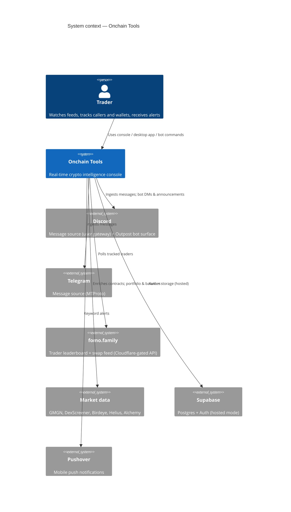
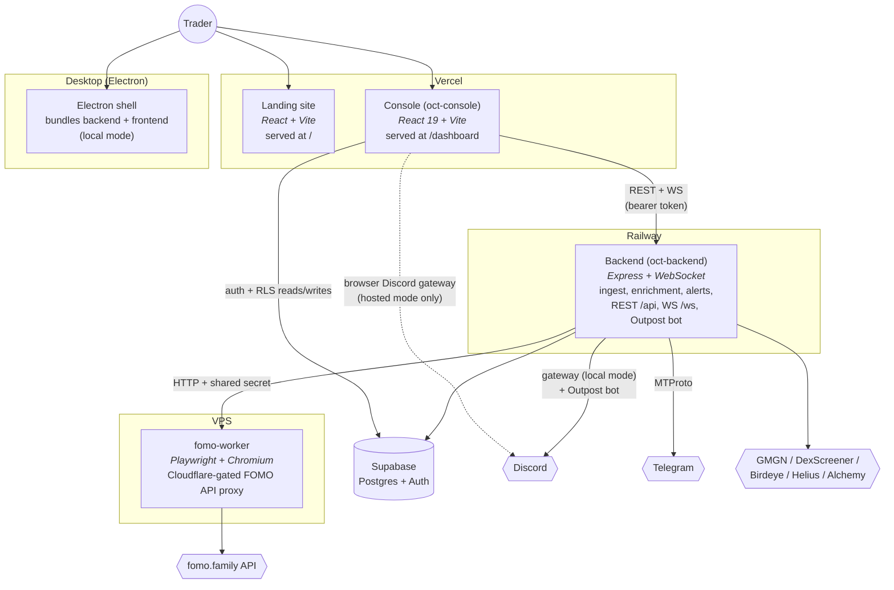
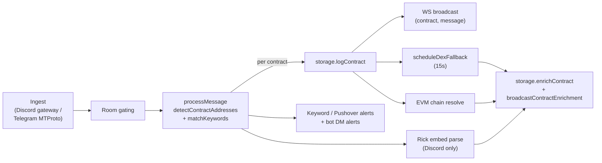
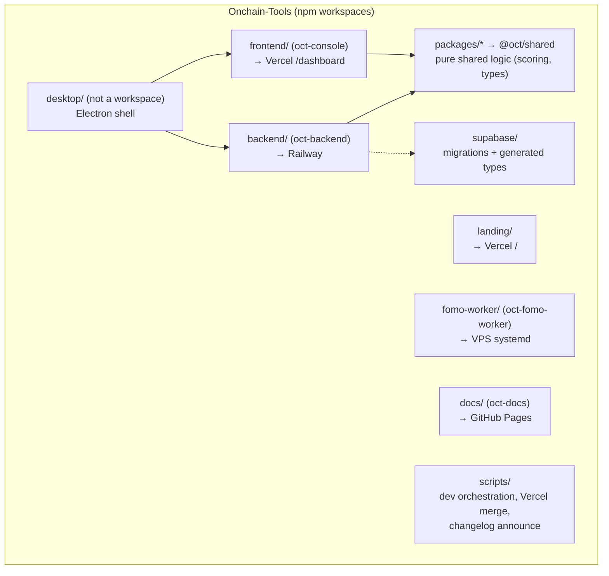

This is the top of the System Design Document. It follows the
[C4 model](https://c4model.com/): this page covers **Context** (level 1) and
**Containers** (level 2); the per-container pages cover **Components**
(level 3) with sequence/state diagrams where behavior matters.

## Level 1 — System context

OCT sits between chat platforms where alpha is called, market-data providers
that price it, and the trader watching the console.

## Level 2 — Containers

Notes that make this diagram honest:

- **WebSockets do not run on Vercel.** The console always connects its WS to
  the Railway backend (`VITE_API_URL`), never the Vercel URL.
- **In hosted mode the Discord user gateway runs in the browser**, not on the
  backend — the user's Discord token never touches the server
  ([ADR-002](../../adr/002-browser-gateway/)). In local mode the backend owns
  one global gateway connection.
- The desktop app is the same backend + frontend running in **local mode**
  inside Electron: one implicit user, JSON storage, loopback bind.
- The fomo-worker exists because fomo.family sits behind Cloudflare; API calls
  must originate from a real stealth Chromium page
  ([ADR-005](../../adr/005-fomo-worker/)).

## The core pipeline

Discord and Telegram share one ingest pipeline. This is the heart of the
system — most features hang off it:

Deep dives: [Backend components](../backend/), [Frontend](../frontend/),
[Signals](../signals/), [Discord bot](../discord-bot/),
[fomo-worker](../fomo-worker/).

## Monorepo layout (package diagram)

npm workspaces; `desktop` is deliberately **not** a workspace (invoked via
`npm --prefix desktop`).

## Design principles worth knowing

1. **Two modes everywhere.** Local vs hosted is the axis nearly every branch
   keys off — [read it first](../two-modes/).
2. **Signals stay independent.** Convergence, FOMO buys, and missed-runner are
   distinct detections; they are routed and displayed together but never fused
   ([ADR-004](../../adr/004-independent-signals/)).
3. **Provider split is deliberate.** GMGN → enrichment + missed-runner;
   DexScreener → metadata fallback; Birdeye → portfolio only
   ([ADR-003](../../adr/003-provider-split/)).
4. **Storage goes through the interface.** `StorageProvider` methods take
   `userId` first; JSON and Supabase implementations sit behind it
   ([Data model](../../data/storage/)).
5. **Background subsystems self-gate** on their env vars, so the server runs
   cleanly with any subset configured.
