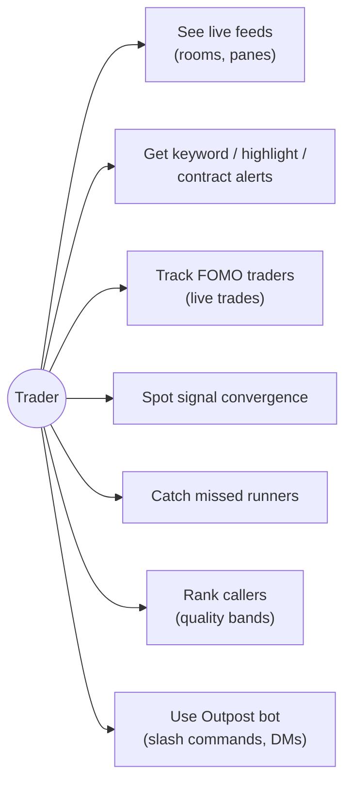
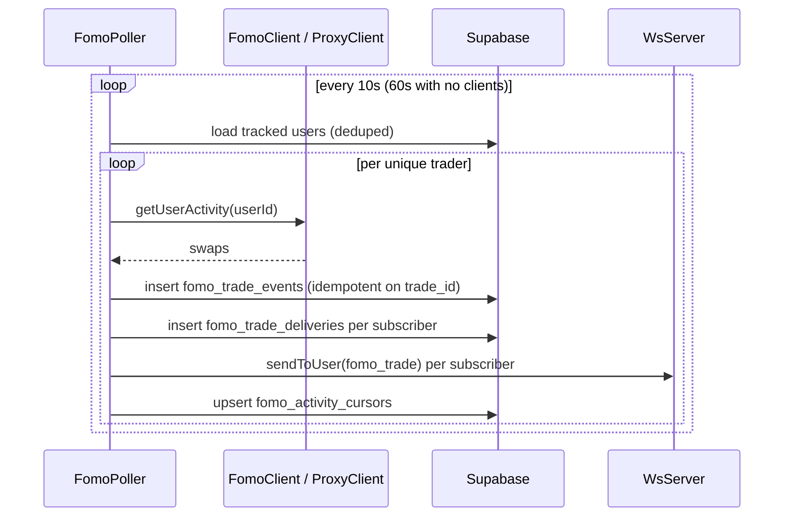
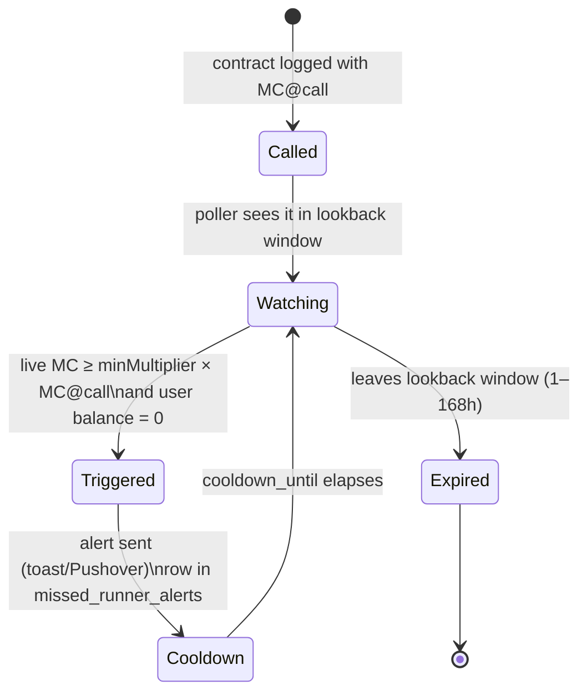

OCT raises four kinds of "pay attention" signals. They are **deliberately
independent detections** — routed and displayed together, never fused
([ADR-004](../../adr/004-independent-signals/)).

## Use-case view

## FOMO trade tracking

`fomo/poller.ts` polls each **unique** tracked trader once (deduped across
subscribers), stores swaps, then fans out per user:

The interval is adaptive: `10 s` while any authenticated WS client is
connected, `60 s` idle. On reload the console backfills 24 h of trades from
`GET /api/fomo/trades` (read from the *delivery* log, so a user only sees
trades that were actually fanned out to them), merging live frames deduped by
`trade_id` in both directions. A retention sweeper prunes events past
`FOMO_TRADE_RETENTION_DAYS` (default 7).

## Missed-runner alerts

The poller (`alerts/missedRunnerPoller.ts`, default every 3 min) walks recent
contract calls, compares MC-at-call against live MC (GMGN), checks the user
actually *held* nothing (Helius/Alchemy balance checks on holding wallets),
and alerts when the multiplier clears the configured threshold.

Test/dry-run endpoint: `POST /api/alerts/missed-runner/test` returns full
diagnostics (`wouldAlert`, `blockReason`, `multiplier`, …).

## Signal convergence

Client-side correlation ([frontend](../frontend/#signal-convergence-client-side)):
a contract call and a tracked trader's **buy** of the same address within the
configured window (default via `signalConvergenceWindowMinutes`). Compares
the trade's `occurredAt`, not arrival time, so replayed history can't fire
false convergences after a reload.

## Caller quality

Two layers, manual always overriding earned
(`@oct/shared/callerQuality.ts` — pure, 21 unit tests):

- **Manual tiers**: `muted` / `normal` / `trusted` per caller, global or
  per-room; room entry beats global; when a contract lands in several rooms
  the most restrictive tier wins.
- **Earned bands**: each caller scored on *their own* calls — MC when they
  posted vs the token's peak since (`token_peaks`, sampled by
  `tokenPeakSampler`). One caller/token pair counts once; below
  `MIN_RATED_CALLS = 10` a caller stays `unrated`. Bands:
  `unrated | slop | mixed | solid | elite`.

Scores surface in the contract feed and Callers radar
(`GET /api/callers/scores`, 120 s cache); chat only colors the username since
reordering chat would break reply context. Quality is a display/filter layer
— deliberately **not** folded into convergence scoring.

## Alert delivery matrix

| Signal | Toast | Pushover | Bot DM (opt-in) | WS frame |
| --- | --- | --- | --- | --- |
| Highlighted user | ✔ | ✔ (filtered) | ✔ | `alert` |
| Keyword match | ✔ | ✔ | ✔ | `alert` |
| Contract detected | ✔ | ✔ | ✔ | `alert` + `contract` |
| Missed runner | ✔ | ✔ | ✔ | `alert` |
| FOMO trade | feed | per-trader `notify_pushover` | — | `fomo_trade` |
| Convergence | ✔ (client) | ✔ (via REST) | — | client-only |

Bot DMs ride the `WsServer.onAlert` seam and are gated per user per trigger
(`discordBotDm.triggers`) — see [Discord bot](../discord-bot/).
