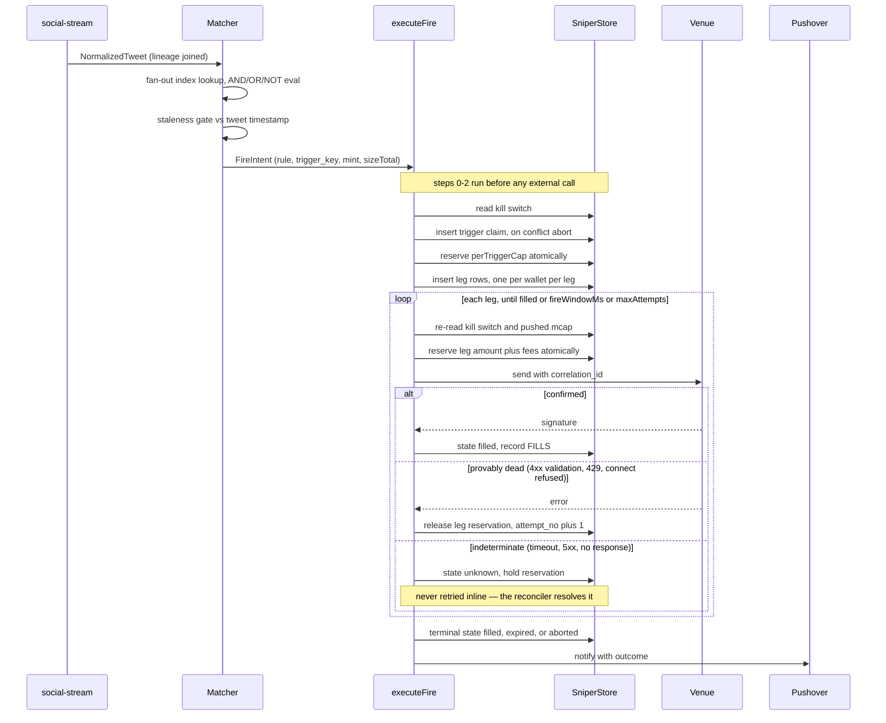

Exactly one function may spend: `executeFire`. Every control lives inside it,
because a control anywhere else can be routed around — by a retry, by a ladder
leg, by a second wallet, or by a future caller who didn't read this page.

:::note[Shipped, with two gaps]
`executeFire`, the risk gate, the reservation and the Slotshark executor are
built and running (2026-08-07 — see [what shipped](../sniper/#what-shipped-in-the-alpha)).
`fireOrchestrator.ts` is its only caller, and the only way to reach that is
`POST /sniper/v1/rules/:id/fire` — a human pressing a button. **The matcher never
calls it, because there is no tweet feed.** The two gaps are the reconciler and
the empirical error taxonomy, both flagged in place below.
:::

## Phase 1 fire path



Note the asymmetry in the `alt`: **only provably-dead attempts release their
reservation and retry.** An indeterminate send holds its reservation and exits the
loop. The reference implementation this pattern comes from warns about exactly
this — giving up while the trade succeeds makes the operator re-fire and
double-buy.

## Execution venues

**Phase 1 ships exactly one real venue: Slotshark.**

| | Slotshark (Phase 1) |
| --- | --- |
| Chains | Solana only |
| Custody | **custodial** — the account holder funds a wallet in Slotshark's own dashboard |
| Fire path | `POST /buy` |
| Private key in our system | **none** — custodial |
| Our credential | developer API token (Bearer) |
| Credential blast radius | token authorizes **buy, sell and withdraw**: a leak is a total drain of every funded wallet — see [security T3](../sniper-security/) |
| Fee | 0.5% per trade |
| Regions | `us`, `eu` (fixed compile-time enum) |

### GMGN is not a Phase 1 venue, on purpose

OCT already holds a `GMGN_API_KEY` — but it belongs to the **operator** and is
provisioned for enrichment and market data (`utils/gmgnClient.ts`). Promoting it to
a trading credential would route every user's snipes through the operator's own
GMGN account: commingled funds, and a custody problem created by accident rather
than decision.

So `Venue` in `backend/src/sniper/types.ts` is `'slotshark' | 'dryrun'`, and
`venueCredentials.ts` maps no venue to `GMGN_API_KEY`. The exclusion is structural,
not a convention someone can forget.

When GMGN trading does land, it arrives as a **per-user connected credential**
([ADR-012](../../adr/012-venue-tenancy/)) resolved from Vault — the user brings
their own GMGN account. That is milestone M11, and it unlocks the EVM/BSC leg at
the same time. Two properties of GMGN carry forward to that work, both established
during research: it is **custodial** (a swap takes `--from <wallet_address>`, no
private-key parameter, and returns an `order_id` to poll), and it fires
**deterministically** via signed REST at `openapi.gmgn.ai` — the "Agent API" /
gmgn-skills layer is `SKILL.md` markdown plus a CLI over those same `/v1/*`
endpoints, so it belongs to Phase 3 rule *composition*, never the fire path. Its
separate **cooperation router** (1 call / 5 s, unsigned tx) stays disqualified by
the latency budget regardless.

Any additional venue is a new `Executor` — no change to the risk gate or the rule
schema.

### Slotshark request shape

`POST https://{us|eu}.slotshark.xyz/buy`, `Authorization: Bearer <token>`:

```json
{ "mint": "...", "solAmount": 0.5, "wallet": "...", "slippage": 20,
  "antimev": true, "retries": true, "tip": 0.001, "priorityFee": 0.0005 }
```

Omitting `tip` / `priorityFee` is meaningful — it selects the venue's auto
pricing, so they are assigned conditionally rather than sent as `null`. The region
is a **fixed compile-time enum, never operator input**; a free-form base URL would
be an SSRF vector. That pattern is not optional — see threat T4 in
[security](../sniper-security/).

### The executor registry

As shipped in `backend/src/sniper/types.ts`:

```ts
type Venue = 'slotshark' | 'dryrun';

interface Executor {
  readonly venue: Venue;
  readonly chains: readonly Chain[];
  send(intent: FireIntent, leg: FireLeg, correlationId: string): Promise<SendOutcome>;
}

type SendOutcome =
  | { kind: 'filled'; signature: string; amountIn: number; amountOut: number; feePaid: number }
  | { kind: 'dead'; reason: DeadReason; status: number }
  | { kind: 'unknown' };
```

`send` takes the **leg**, not just the intent, because one trigger fans out to one
leg per (wallet x ladder step) and each leg is a separate send with its own
reservation and its own `correlationId`.

`reconcile(wallet, mint, since)` is specified and **still not implemented**. It was
scheduled to land with M3; M3's code shipped without it, because reconciling needs
a venue **fill-history** query and no Slotshark endpoint of that kind is verifiable
from this repo — the only one that is, is `POST /buy`. `sniper/reconcile.ts` ships
as the interface plus a `TODO(unverified)` naming exactly what is missing; nothing
implements it and nothing calls it.

**The consequence is live and the UI states it:** an `unknown` leg holds its budget
reservation indefinitely and is never retried, so that wallet's daily cap stays
debited by an amount that may or may not have been spent. The alpha's substitute is
a human — `POST /sniper/v1/fires/:id/resolve` records what the operator found in
Slotshark's own dashboard, and the Fires tab pins a count of legs in this state.
That is a stand-in, not a replacement: it does not scale past a handful of manual
fires, and M2 would make it untenable.

The interface is deliberately shaped as a history query
rather than `status(ref)`: an indeterminate send returned no response, therefore no
venue reference, so `status(ref)` cannot service the case it exists for.
Reconciliation queries the venue's own fill history by
`(wallet, mint, since)` and matches against our leg rows. Where a venue accepts a
client-supplied idempotency key, `correlationId` is passed through and
reconciliation is exact; where it does not, the match is heuristic and that is
stated at the call site.

### Chain-tagged execution params

Execution params are not portable across chains, so they are modelled as a
discriminated union rather than a flat bag:

```ts
type ExecParams =
  | { kind: 'sol'; tip?: number; priorityFee?: number; antimev: boolean }
  | { kind: 'evm'; maxFeePerGas?: string; maxPriorityFeePerGas?: string;
      gasLimit?: string; mevRelay?: 'bloxroute' | '48club' | 'blockrazor' | null };
```

The Solana fields are the `tip` / `priorityFee` / `antimev` shape in the Slotshark
request above; omitting `tip` / `priorityFee` still selects the venue's auto
pricing. On BSC the Jito analogue is **gas bidding plus a private-relay choice** —
bloXroute, 48Club or BlockRazor — against a ~0.45 s block time. One caveat when
firing **through** GMGN: GMGN's `--anti-mev` is a boolean and GMGN picks the relay,
so `mevRelay` is only actionable if OCT submits to a relay directly.

**BSC carries rug classes Solana does not.** Honeypots, transfer taxes, pausable
and upgradeable-proxy tokens cannot exist on a standard SPL mint but are routine on
BSC. The services that catch them — GoPlus, honeypot.is — take ~3 s, which
**disqualifies them from the hot path** exactly as GMGN's cooperation router is
disqualified. So BSC either pre-screens out of band — a candidate clears screening
*before* it can arm a rule — or the operator accepts the risk at a deliberately low
cap. There is no inline check that fits the budget; state it honestly.

### Error taxonomy

| Venue signal | Kind | Retry? |
| --- | --- | --- |
| 400/422 validation | `validation` | no — the request is wrong, not the network |
| 401/403 | `auth` | no — alert, trip the kill switch |
| 429 | `rate_limit` | yes, with backoff — provably not submitted |
| Connection refused / DNS | `network` | yes — provably not submitted |
| Timeout (`AbortSignal.timeout`) | — | **`unknown`** |
| 5xx | — | **`unknown`** |
| Anything unmapped | — | **`unknown`** |

A 5xx is *not* provably unsubmitted — a gateway can time out downstream of a
submission that landed. Only signals that prove the request never reached the
chain are retryable. **The default for anything unrecognized is `unknown`, not
`dead`**, because the failure mode of guessing wrong is a double buy.

Slotshark's real taxonomy is still not documented to us, and the alpha did not
learn it — shipping the executor is not the same as watching it fail in the ways
the venue actually fails. **This table is still the guessed one**: only the rows
above are mapped and everything else falls through to `unknown`. It gets replaced
by observation on M3's live half, not by M5 (the venue connect flow, which shipped
and taught us nothing about errors).

## Risk-control enforcement

### The reservation

Check-then-spend is a race. The cap is reserved in the same statement that tests
it, and a zero-row result means refused:

```sql
-- $amount is pre-clamped by the caller to
--   min(rule.per_fire_cap, budget.per_fire_cap, requested)
-- and INCLUDES venue fee, tip and priority fee.
insert into sniper_budget (user_id, wallet_id, chain, unit, day,
                           per_fire_cap, spent_today, open_positions)
values ($user, $wallet, $chain, $unit, $day, $default_cap, 0, 0)
on conflict (wallet_id, chain, day) do nothing;

update sniper_budget
   set spent_today   = spent_today + $amount,
       open_positions = open_positions + 1
 where wallet_id = $wallet
   and chain     = $chain
   and day       = $day
   and unit      = $unit
   and $amount  <= per_fire_cap
   and spent_today + $amount <= daily_cap
   and open_positions < max_open
returning id;
```

Four things here are load-bearing and each was a defect before review:

- **The `insert ... on conflict do nothing` is not optional.** Without it the
  `update` matches zero rows on the first fire after every date rollover, which
  the design reads as "cap refused" — so every fire is refused until someone
  inserts a row by hand.
- **`wallet_id` and `chain` in the predicate.** Keyed on `user_id` alone, a
  two-wallet operator matches both rows, debits both, and returns two rows — so
  the zero-row test passes while the wrong budget was checked.
- **`unit` in the predicate.** Without it, `5` (SOL) validates against a
  `per_fire_cap` of `1000` (USDC) and 5 SOL leaves the wallet. Caps are
  deliberately denominated in native units to avoid an oracle, which only works if
  incommensurable numbers never meet.
- **`$amount` includes fees.** Slotshark's 0.5%, plus `tip` and `priorityFee`, are
  all real funds leaving the wallet. Debiting `solAmount` alone makes a daily cap
  soft by an unbounded margin.

Assert exactly one row updated. Any other count is a hard abort, not a pass.

### Two cap levels

| Cap | Bounds | Reserved |
| --- | --- | --- |
| `perTriggerCap` | `sizeTotal × walletIds.length` — the whole tweet | once, before the first leg sends |
| `perFireCap` | one leg on one wallet | per leg, in the statement above |

Without `perTriggerCap`, a five-leg ladder each at `perFireCap` spends
5 × `perFireCap` on one tweet, and "per-fire cap" bounds nothing an operator
thinks it bounds.

### Where each control lives

| Control | Enforced at | Survives restart |
| --- | --- | --- |
| Kill switch | `sniper_state` row, re-read every attempt | ✔ |
| Trigger idempotency | unique index, written before any send | ✔ |
| Per-trigger cap | `executeFire` step 2 | ✔ |
| Per-fire cap | the reservation statement | ✔ |
| Daily cap | same statement | ✔ |
| Max concurrent positions | same statement | ✔ |
| Fires-per-minute breaker | `executeFire`, trips the kill switch above K | ✔ |
| Auto-disable after fire | same transaction as the reservation | ✔ |
| Retry ceiling | `attempt_no` on the leg row, updated in place | ✔ |

The fires-per-minute breaker is distinct from per-rule caps and exists for
fan-out amplification: 50 rules on one handle and one viral tweet is 50 fires,
each individually within its cap.

### The control plane is part of this

The sniper's API **must not** mount on the existing local `/api` router.
`backend/src/index.ts:621` falls through to `app.use(cors())` in local mode —
wildcard origin — and `backend/src/auth/middleware.ts:32` sets
`req.userId = 'local'` with no credential. Any web page
the operator visits can therefore issue a cross-origin `fetch` to
`http://127.0.0.1:3001/api/...` and read the response. For today's endpoints that
leaks tokens; for a money-spending endpoint it would let a web page author an
armed rule with caps of its own choosing, and every control above would be intact
and irrelevant because the attacker wrote the rule.

Requirements, in both modes — **all three shipped**, in `backend/src/api/sniper/`:

- A per-boot random bearer token written to a `0600` file under `OCT_DATA_DIR`
  (`controlToken.ts`). Local clients fetch it once from `GET /sniper/v1/session`,
  which is itself loopback- and `Origin`-gated; a backend restart rotates it and
  clients re-fetch on the resulting 401.
- A strict `Origin` / `Host` check on every sniper request (`auth.ts`).
- Mounted **outside `/api`**, at `/sniper/v1`, and mounted in `index.ts` *before*
  `app.use(cors())` — so the CORS policy binding it is its own and not the
  app-wide one, and the hosted `generalLimiter` (300 req/min/IP, `/api`-prefixed)
  cannot throttle it. It therefore carries its own body parser, its own rate limit
  and its own auth. This is why `createSniperRouter()` takes no `WsServer` and no
  `RouterContext`: either would force it to be constructed after the middleware it
  must precede. Do not "tidy" it into `api/routes/` alongside its siblings.

#### What "its own CORS policy" means, precisely

Not "emits no `Access-Control-Allow-*` header at all". **Both shipped browser
deployments are cross-origin**: hosted serves the console from Vercel while
`VITE_API_URL` must point at Railway, and local dev serves it from vite on `:5173`
against a backend on `:3001`. `sniperFetch` always sets `Authorization` or
`X-OCT-Sniper-Token`, which forces a preflight — so a plane that answered every
`OPTIONS` with a bare 403 would render the Sniper tab permanently empty, with no
error surfaced anywhere. Only the Electron shell is genuinely same-origin.

What `denyCrossOrigin` actually does is own the allow list:

- **Allowed origin** — gets `Access-Control-Allow-Origin` echoing the exact
  origin (never `*`) plus `Vary: Origin`; a preflight gets 204 with the method
  and header lists. The set is:
  - *Hosted* — `ALLOWED_ORIGINS` exactly, **failing closed when it is unset**.
    The app-wide hosted `cors()` goes *permissive* when that env var is missing;
    this plane must not, so an operator who forgot it gets a broken Sniper tab
    rather than a cross-origin-writable one.
  - *Local* — loopback is necessary and **not sufficient**. `GET /session` hands
    out the per-boot control token, so any origin allowed here can read it and
    then spend, and a stray page on `localhost:8080` is loopback too. The set is
    the console's own origin: same-origin (proved by comparing `Origin` against
    the request's `Host`, neither of which a page can forge), which covers the
    desktop shell and vite's `/sniper/v1` proxy; plus `http://localhost:5173` and
    `http://127.0.0.1:5173` for a dev console pointed at `:3001` by
    `VITE_API_URL`, which a packaged desktop build excludes because it sets
    `NODE_ENV=production`. Setting `ALLOWED_ORIGINS` overrides all of that.
- **Anything else** — 403 with not one `Access-Control-*` header. A preflight that
  gets no allow header back is a preflight the browser refuses to follow, so the
  block does not depend on the subsequent request also being refused correctly.
- **`Access-Control-Allow-Credentials` is never sent, to anyone.** This plane
  authenticates on a header it sets itself and on nothing ambient. Withholding it
  means a cookie added to this app later cannot silently become a CSRF vector
  against the one surface that spends.

The second property the mount order buys is unchanged: no burst of terminal-state
traffic can be throttled into a retry loop.

[ADR-008](../../adr/008-local-loopback/) argues loopback binding is sufficient for
the current surface. **That argument does not extend to an API that spends money**
— which is why this one does not rely on it.

## The dry-run seam

Three switches, in precedence order. As shipped:

| Switch | Scope | Notes |
| --- | --- | --- |
| `OCT_SNIPER_DRY_RUN=1` | process | uncleavable; wins over everything. The control plane reports it as `processDryRun` and **refuses `409 process_dry_run`** rather than pretending a rule went live under it |
| no connected credential | venue | the practical "off by default": with no token the fire preflights to `no_credential` before constructing anything. The planned `EXECUTION_VENUES.enabled` column was **not** built — venue is a check constraint, not a table (see [rules](../sniper-rules/#what-the-shipped-schema-actually-is)) |
| `SnipeRule.dryRun` | rule | per-rule, **defaults true and is forced true on create**; clearing it is its own confirmed endpoint |

Dry run **exercises the risk machinery rather than bypassing it** — the
reservation is taken for real, so M4's adversarial tests are meaningful. It
therefore also needs a release path: a synthetic fill decrements
`open_positions` and reverses `spent_today` on the same transaction that records
it, because no balance poll will ever show a synthetic position closing. That
release is implemented (it was missing from the first cut, where twenty rehearsals
would quietly exhaust a real daily cap), and every fire row carries a `dry_run`
flag — a money log that cannot tell a synthetic fill from a real one is the most
dangerous ambiguity such a log can have.

## M4: the tests that prove the caps bind

Adversarial, not happy-path. Status as of the alpha — **every ✔ below runs against
the in-memory store, not Postgres**, so what is proven is the *logic*, not the
`sniper_reserve_leg` SQL that reimplements it in hosted mode. Keeping both refusing
identically, for identical reasons, is why the RPC re-reads the row to diagnose a
zero-row update instead of returning a generic refusal.

| # | Test | Status |
| --- | --- | --- |
| 1 | Ladder of 5 legs, each at `perFireCap` → total spend equals `perTriggerCap`, not 5 × `perFireCap` | ✔ `sniperFire.test.ts` |
| 2 | Multi-wallet fan-out across 3 wallets → 3 leg rows, 3 budget rows, one trigger | ✔ |
| 3 | Fire at 23:59:59.9 → the rollover insert fires, the next fire is not refused | partial — the first-use day row is covered; **the rollover instant is not** |
| 4 | Kill switch tripped mid-retry → the in-flight loop aborts before the next send | partial — pre-fire abort is covered, mid-retry is not |
| 5 | Process killed between reservation and send, then restarted → the trigger claim suppresses the replay; the orphaned reservation is released | **open, and half of it is unbuildable** — the release needs the reconciler |
| 6 | Venue times out but the trade landed → `unknown`, the fill is found, exactly one fill row | **open** — same reason; today the leg stays `unknown` until a human resolves it |
| 7 | Rule with `sizeUnit: 'USDC'` and a SOL wallet → refused at arm time | ✔ `sniperValidateRule.test.ts` |

Also covered, and not originally on this list: a duplicate trigger delivery is
suppressed; an `unknown` send is never re-sent and keeps its reservation; and
**20 dry-run fires do not exhaust a 10 SOL daily cap** — the property the synthetic
release above exists to give.
