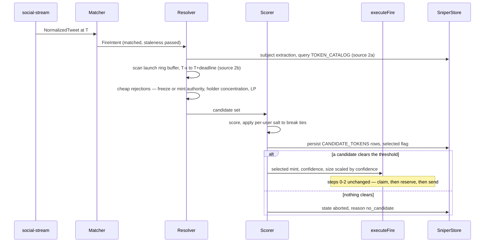

Phase 1 buys a mint the operator typed. Phase 2 buys a mint the system picks. That
is not a variation on Phase 1 — it is a new subsystem, and every hard problem in
this design lives here.

**You cannot be both first and certain.** Resolution costs time by definition, and
any deterministic rule over public data can be farmed: an adversary watching the
same tweet deploys a token at T+3 s engineered to top our score, needing no
privileged access. This page does not pretend that is resolvable. It parameterizes
the tradeoff and sizes positions against what remains unknown.

## The tweet is the clock

Tokens launch *in reaction to* the tweet, at roughly T+2 s to T+60 s. Everyone's
race starts when the tweet lands. So the requirement is **windowed enumeration**,
not block-0 detection — which inverts the usual vendor comparison. Latency
tolerance inside the window is 1–2 s, completeness matters more than speed, and a
100 ms edge on the launch feed is noise.

Volume sets the size of the problem: roughly **40–85 creations per 60 s window**
across all Solana launchpads. *(Derived from a mid-2025 figure of 30–60k pump.fun
launches/day at ~50% launchpad share — order of magnitude only, re-measure before
sizing anything on it.)* That is a tiny candidate set. **Resolution is a scoring
problem, not a throughput problem.**

## Resolution path

The resolver and scorer sit **between** the matcher and `executeFire`. They do not
get their own path to the spend function, and an abort does not route through it.

## Candidate sources

### 2a — pre-existing tokens. A search problem. No new infrastructure.

`backend/src/storage/tokenCatalog.ts` is already the searchable index of every
token OCT has seen, keyed `(address, chain, evm_chain)` with
`symbol/name/pair/fdv/liq/price_usd`, paired with `utils/tokenSnapshot.ts`
`getTokenSnapshot` for staleness refresh.

Two corrections to earlier assumptions:

- **GMGN has no text-search endpoint.** There is no `/v1/token/search`. The nearest
  primitives are `/v1/market/hot_searches` and `/v1/market/rank` — ranking and
  enrichment, not lookup by name. The catalog remains the search substrate.
- **The catalog does not exist in local mode.** Both `getCatalogEntry` and
  `upsertCatalogFromEnrichment` open with `if (!isHostedMode()) return`. Either
  lift that gate or document "local-mode Phase 2a has no catalog." Do not discover
  this at implementation time (Open question 5).

Source 2a has a property no adversary can fake: **the token existed before the
tweet.** Prefer it over 2b whenever both produce a candidate.

### 2b — post-tweet launches. Needs a launch feed.

Recommended, and the reason is architectural rather than commercial. The feed is
per chain; the ring buffer that consumes it is not.

**Solana** — PumpPortal for pump.fun/PumpSwap, Solana Tracker to close the gap:

- **PumpPortal `subscribeNewToken`** over one permanent WebSocket
  (`wss://pumpportal.fun/api/data`), documented as free, covering pump.fun and
  PumpSwap only. Their docs are explicit: **one connection at a time**, do not
  open a connection per token, bans expire hourly.
- **Solana Tracker REST `GET /tokens/latest`**, polled at 1–2 req/s *during the
  resolution window only*, to close the ~50% coverage gap (bonk.fun, LaunchLab,
  Moonshot, Meteora, Boop). Their €50/mo Advanced tier advertises 200 000
  requests/month with no rate limit — about 120 calls per trigger, so roughly
  1 600 triggers/month.

**BSC** — Pinax Substreams (`bsc.substreams.pinax.network`, real-time gRPC). One
caveat is load-bearing: **no off-the-shelf "new token creation" Substreams package
exists for any launchpad** — the published packages decode *swaps*, not creations.
Either write a Rust creation-filter module against the launchpad program, or use
**Bitquery** for four.meme, which already exposes a creation stream. Budget ~1.5 s
of feed drift — an unverified secondary-source number, not measured — which the
ring buffer absorbs; M8 measures the real figure.

**Robinhood** — deferred. The chain (Robinhood's Arbitrum Orbit L2) is real but
only weeks old, its dominant launchpad collapsed within three weeks, and its FCFS
sequencer with no mempool makes tip and priority knobs structurally inert. There
is no launch feed to build for it in v1.

**Architecture: a rolling ring buffer, not a request.** Hold the connection open
permanently and push creations into an in-memory buffer of the last ~5 minutes.
On trigger, enumeration is a **memory scan, not a network call** — near-zero added
latency, and it lets us look at **T−x as well as T+x**, catching tokens deployed in
the seconds *before* the tweet landed, which a request/response design misses
entirely.

Second choice if polling proves insufficient: **Solana Tracker Datastream**
`latest` room (`wss://datastream.solanatracker.io/{apiKey}`, join
`{"type":"join","room":"latest"}`), €397/mo Premium. It ranks above
broader-coverage alternatives for one reason — its payload already carries
sniper/insider/rug/dev-held risk metrics, which is exactly what the anti-farm
score needs, avoiding a second enrichment round trip inside the window.

Ruled out:

| Option | Why not |
| --- | --- |
| Helius Webhooks, Moralis Streams | HTTP push needs a publicly reachable endpoint — breaks loopback-bound local mode outright, and adds a hop |
| Jupiter `/tokens/v2/recent` | keyed on first *pool* creation, not mint, and indexed "in under a minute" against a 60 s window |
| GeckoTerminal, DexScreener | 30–60 req/min caps, pool-indexed not creation-indexed. Fine as post-hoc cross-check, which OCT already does via `utils/tokenEnrichment.ts` |

If we later want to own the pipe: **Chainstack** (~$98/mo — $49 Growth base plus
$49 Yellowstone add-on, 2 streams; the cheapest verified real Yellowstone gRPC) or
**Triton One** ($125 prepaid deposit plus $0.08/GB, no per-call fee). Triton
uniquely exploits the windowed requirement: Yellowstone's subscribe request is
bidirectional, so a warm connection can hold a slots-only filter and widen to the
launchpad program ids on trigger. The trap on any raw path is that Yellowstone
filters by **program, not instruction** — subscribing to pump.fun means ingesting
every buy and sell to find ~40 creates, and that is the entire bandwidth and
parsing bill, plus a per-launchpad IDL/discriminator parser to maintain forever.

**Every latency number any of these vendors publishes is a vendor claim with no
methodology.** M8 is a shadow harness that logs, per trigger, tweet timestamp →
creation-event arrival timestamp and the coverage delta between sources. Do not buy
a tier on the strength of a marketing adjective.

## Resolution policy

`ResolutionSpec` selects one. All four are legitimate; they trade differently.

| Policy | How | Latency cost | Failure mode |
| --- | --- | --- | --- |
| Narrow by deployer | accept only candidates whose deployer is on an operator allowlist | ~0, in-memory set | near-zero recall — misses every genuinely new deployer, which is most of them |
| Scored race with a hard deadline | enumerate, score, take argmax at `deadlineMs` | exactly `deadlineMs` | if bait dominates the score you buy the bait; a longer deadline buys confidence and loses the race |
| Laddered entry | split `sizeTotal` across the top N | same as the scored race | you buy the bait **too** — laddering mitigates *variance* and simultaneously *increases* farm exposure |
| Scout then conviction | small first leg immediately, second after corroboration at T+X | first leg fast, second costs X | two fills at a worse average; the scout leg is a subsidy paid to whoever won the race |

Parameterizing the tradeoff:

- `resolution.deadlineMs` is the operator's dial between speed and confidence.
- Size scales with confidence: `size = min(perFireCap, base × confidence)`, where
  `confidence` falls out of the score margin — the gap between first and second
  place — not out of a hope.
- **Phase 2 rules carry a structurally lower `perFireCap` than Phase 1 rules**,
  clamped at arm time and enforced at the reservation. Phase 1 has no scoring
  function to farm; Phase 2 does.

## Scoring as a framework, not an answer

The scorer is a weighted sum over extracted features. **The features below are the
available inputs. This document does not assert which of them predict anything,
and no default weights ship.** A Phase 2 rule with unset weights cannot arm — fail
closed rather than shipping a plausible-looking default that reads as advice.

Grouped by what an adversary would have to fake:

| Cost to fake | Features |
| --- | --- |
| Cheap | name/symbol similarity to the tweet subject, metadata, `ai_suggestion` ticker agreement, social links |
| Costlier | liquidity depth, holder count, `sniperCount`, `devHeldPercentage`, deployer wallet history, LP burned or locked, freeze and mint authority state, top-holder concentration excluding LP |
| Not fakeable | the token existed **before** the tweet (source 2a) |

Structural anti-farm controls, independent of any weight:

- **Never resolve on text similarity alone.** Require corroboration that costs the
  adversary something.
- **Do not publish the scoring function**, and add a per-user secret salt
  tie-breaker: `score' = score + ε·H(userSecret ‖ mint)`. This randomizes *ties* so
  one bait token cannot be tuned to win for every operator. It does not save you
  if bait genuinely dominates. The salt is a server-held secret keyed to the user —
  **not a field inside `ResolutionSpec`**, which the console reads and writes.
- **Prefer 2a over 2b** whenever both produce a candidate.
- **Cheap Solana rejections before scoring:** freeze authority set, mint authority
  live, top holder over 30% ex-LP, LP not burned or locked.
- **Sellability simulation on the single best candidate only** — 50–200 ms,
  affordable once, not per candidate.
- **A hard per-fire cap.** It is the only mitigation that always works.

## Shadow mode first

M9 runs the whole path and fires nothing, persisting `CANDIDATE_TOKENS` for every
trigger: what each source saw, when it arrived, the score, and which candidate
would have been selected. The question it answers is not "is the scorer
profitable" — it is "does the scorer pick what the operator would have picked,
and how often was the winner farmable." Only then does M10 arm it, at a lower cap.
