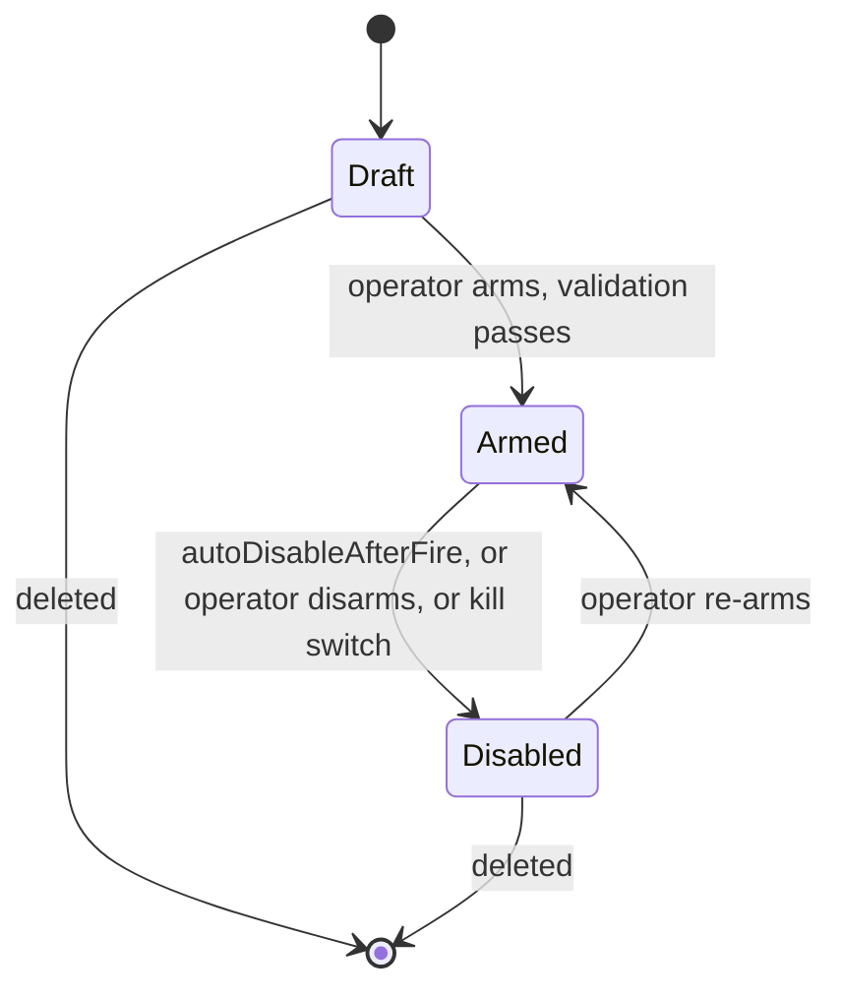
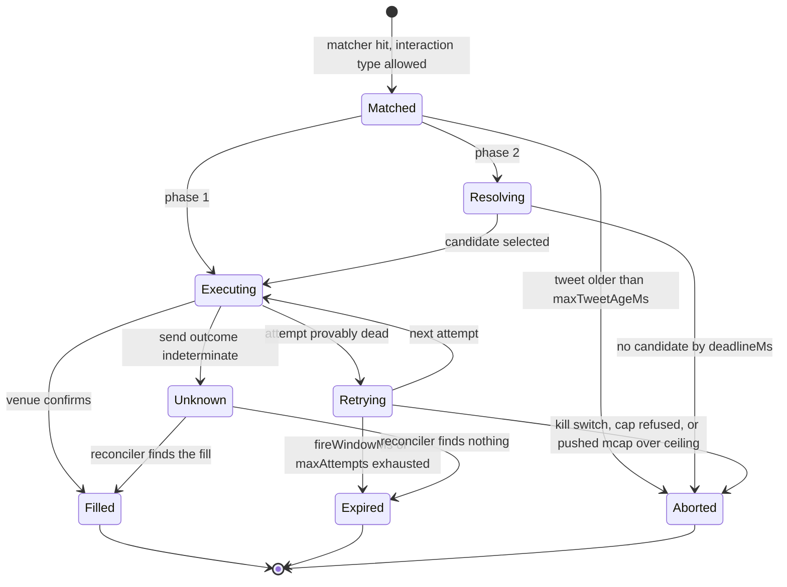
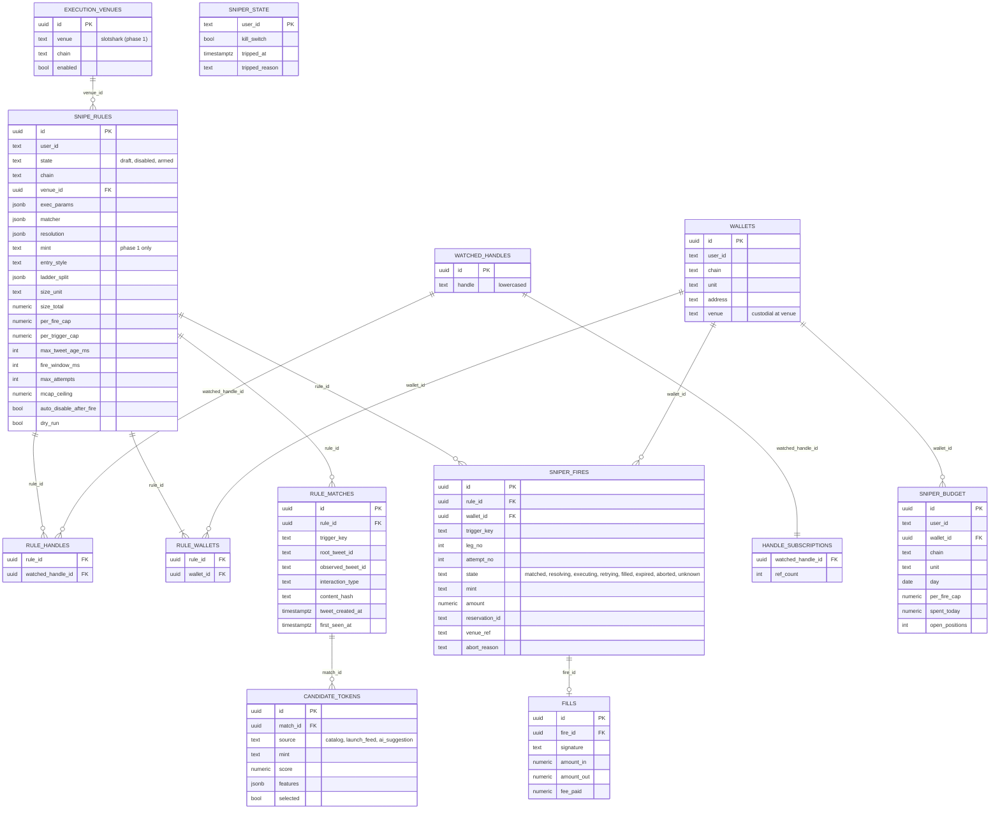

The rule schema is the most important artifact in the system. Phase 3's compiler
has to emit it, the console has to render it, and the risk gate has to enforce it.
Get it precise here and the rest follows.

:::caution[Three of these fields are stored and inert]
The schema below shipped whole, but **`handles`, `interactionTypes` and `matcher`
gate nothing today** — OCT reads no tweets, so the matcher is never invoked and
the fan-out index is never built (see [what shipped](../sniper/#what-shipped-in-the-alpha)).
They are persisted so a rule written today still means the same thing when the
feed lands at M2. The console shows them inside a disabled fieldset headed
`TRIGGER — STORED, NOT WIRED`, and the migration says the same thing in a column
comment. The idempotency machinery below is likewise built but only ever exercised
by console fires, and the ERD is the *design* — what the database actually holds is
[at the end of this page](#what-the-shipped-schema-actually-is).
:::

## SnipeRule fields

| Field | Type | Meaning |
| --- | --- | --- |
| `id` | `uuid` | — |
| `name` | `string` | operator label |
| `state` | `'draft' \| 'disabled' \| 'armed'` | rule-level only. Fire-level states live on `SNIPER_FIRES` |
| `chain` | `'sol' \| 'bsc'` | selects the executor. **Phase 1 executes `sol` only** — `bsc` is modelled so the EVM leg needs no schema change, and `ExecutorRegistry.resolve` throws rather than routing it to a Solana venue. Robinhood deferred |
| `venueId` | `uuid` | FK to `EXECUTION_VENUES` |
| `handles` | `string[]` | watched accounts, lowercased. Denormalized into `RULE_HANDLES` |
| `interactionTypes` | `('tweet'\|'retweet'\|'quote'\|'reply'\|'pin')[]` | which interactions count |
| `matcher` | `MatcherNode` | AND/OR/NOT tree, below |
| `phase` | `1 \| 2` | `1` requires `mint`; `2` requires `resolution` |
| `mint` | `string \| null` | Phase 1 only. Bound at creation |
| `resolution` | `ResolutionSpec \| null` | Phase 2 only. See [Phase 2](../sniper-phase2/) |
| `entryStyle` | `'single' \| 'ladder'` | operator's choice |
| `ladderSplit` | `number[] \| null` | fractional weights summing to 1. `null` when `single` |
| `sizeUnit` | `'SOL' \| 'BNB' \| 'ETH' \| 'USDC'` | must match every wallet's `unit` |
| `sizeTotal` | `numeric` | **total** spend per trigger, before splitting. Legs get `sizeTotal × ladderSplit[i]` |
| `walletIds` | `uuid[]` | one or many. Denormalized into `RULE_WALLETS` |
| `perFireCap` | `numeric` | caps one leg on one wallet |
| `perTriggerCap` | `numeric` | caps `sizeTotal × walletIds.length` — the whole tweet |
| `slippageBps` | `int` | 1–10000 |
| `execParams` | `ExecParams` | chain-tagged fee and relay knobs, below. Unset numeric fields select venue auto-pricing |
| `maxTweetAgeMs` | `int` | **trigger eligibility.** Reject if the tweet is older than this |
| `fireWindowMs` | `int` | **retry budget.** Stop attempting after this, from first attempt |
| `maxAttempts` | `int` | hard ceiling independent of `fireWindowMs` |
| `mcapCeiling` | `numeric \| null` | abort if a *pushed* market cap exceeds this. Never fetched inline |
| `autoDisableAfterFire` | `boolean` | default `true` |
| `dryRun` | `boolean` | per-rule dry run |

`sizeTotal` rather than a per-leg size is deliberate: it makes `perTriggerCap`
checkable before the first leg sends, and it removes the ambiguity of specifying
both a size and a split.

**`maxTweetAgeMs` and `fireWindowMs` are different clocks.** The first is measured
against the tweet's own timestamp and decides whether to start at all. The second
is measured from the first attempt and decides when to give up. Conflating them
lets a rule with a 10 s age limit still be retrying at T+110 s.

## Execution parameters

Fee and relay controls are **chain-tagged**, because Solana and EVM price
inclusion differently. The flat `tip`/`priorityFee`/`antimev` triple is Solana's
vocabulary; BSC bids gas and picks a private relay instead. `exec` is a
discriminated union on `kind`:

```ts
type ExecParams =
  | { kind: 'sol'; tip?: number; priorityFee?: number; antimev: boolean }
  | { kind: 'evm'; maxFeePerGas?: string; maxPriorityFeePerGas?: string;
      gasLimit?: string; mevRelay?: 'bloxroute' | '48club' | 'blockrazor' | null };
```

- `kind` is `'sol'` for a `sol` rule and `'evm'` for a `bsc` (or `base`) rule — one
  EVM shape covers every EVM chain, so the tag is not a redundant copy of `chain`.
  An unset field selects venue auto-pricing; `antimev` defaults to `true`. EVM gas
  fields are wei-valued **strings** because `bigint` does not JSON-serialize into
  the rule store.
- On BSC the relay choice (`mevRelay`: `bloXroute`, `48Club`, `BlockRazor`) is the
  Jito analogue — block time ~0.45 s.
- **`mevRelay` is only actionable when OCT submits the transaction directly.** A
  custodial venue that exposes anti-MEV as a boolean picks the relay itself, and
  ignores this field. No Phase 1 venue reads it — it is modelled now so the EVM leg
  does not need a schema change later.

## Matcher grammar

Extends `KeywordPattern` from `packages/shared/src/types.ts`
(`includes | exact | regex`) with boolean composition:

```ts
type MatcherNode =
  | { op: 'leaf'; pattern: KeywordPattern }
  | { op: 'and' | 'or'; children: MatcherNode[] }
  | { op: 'not'; child: MatcherNode };
```

Evaluated against the tweet's normalized text. Constraints:

- Depth capped (8) and node count capped (64) — a rule is operator input, and in
  Phase 3 it is *model* output.
- `regex` leaves are compiled once at arm time, not per tweet, and validated
  against a linear-time engine. An LLM-emitted regex is a ReDoS vector.
- Case-folded and whitespace-normalized. `t.co` links arrive pre-expanded from
  J7, so a URL substring match works on the destination.
- No semantic matching in Phase 1. It would put a model in the hot path.

## Interaction types

`interactionTypes` is per rule because the operator's intent differs. Elon
*writing* a word and Elon *retweeting* someone who wrote it are both interactions
with the word — the default is to accept both. Elon tweeting and then pinning the
same tweet is one event the operator cares about, so lineage collapses it rather
than firing twice.

## Idempotency and the double-fire hazard

Three separate mechanisms would produce duplicate fires:

1. **Two provider lanes.** J7 emits the same tweet as `tweet` (`provider: p_v1`,
   enriched) and `tweet_update` (`p_v0`, lean). No ordering guarantee.
2. **Retweets carry the original text.** A retweet of a matching tweet matches too.
3. **Restart replay.** Nothing in J7 replays, but our own buffers can.

Only the enriched lane carries retweet lineage. So *collapsing to a root tweet id*
fails when the lean lane arrives first — there is no root to collapse to yet, we
fire, and the enriched lane later reveals it was a retweet of something we already
fired on. **Lineage-based dedupe alone is defeated by lane ordering.** Two things
fix it together:

- **A 150 ms join window** before matching, held in social-stream, letting the
  enriched lane supply lineage. Budgeted at hop 3 in [the overview](../sniper/).
- **A content-hash guard** as the backstop for the case where the enriched lane
  never arrives: `(rule_id, content_hash)` unique within `dedupeWindowMs`.

Two claim levels, both durable, both written **before any external call**:

| Claim | Key | Purpose |
| --- | --- | --- |
| Trigger claim | `(rule_id, trigger_key)` where `trigger_key = rootTweetId ?? observedTweetId` | one trigger per rule per tweet |
| Content guard | `(rule_id, content_hash)` within `dedupeWindowMs` | catches lineage-unavailable duplicates |
| Leg row | `(rule_id, trigger_key, wallet_id, leg_no)` | one row per leg per wallet |

The confirmed key `(ruleId, rootTweetId)` identifies the **trigger**; the leg
constraint adds the fan-out discriminators so one trigger yields exactly one row
per leg per wallet. Without that split, `entryStyle: 'ladder'` and multi-wallet
fan-out are impossible — legs 2..N collide on the trigger key and abort as
duplicates, with money attached.

`attempt_no` is a counter updated **in place** on a leg row. A retry that inserts
a new row defeats the constraint.

**Known tradeoff:** the content guard suppresses a second fire when two different
watched handles post identical text within the window. Scoping it to
`(rule_id, handle, content_hash)` would allow both — that is Open question 8.

### Worked example: four frames, one fire

Rule `R1` watches `@elon` and `@jensen`, `interactionTypes: ['tweet','retweet']`.

| # | T | Frame | Outcome |
| --- | --- | --- | --- |
| 1 | 0 ms | `tweet_update` (`p_v0`) — tweet `T1` by `@elon`, no lineage | held in the join window |
| 2 | 40 ms | `tweet` (`p_v1`) — same `T1`, lineage confirms original | lane dedupe drops it as a duplicate of #1; lineage merged |
| 3 | 150 ms | join window closes | `trigger_key = T1`. Claim taken. **One fire.** |
| 4 | 9 s | `tweet_update` — tweet `T2` by `@jensen`, retweet of `T1`, same text | lineage resolves root to `T1`; trigger claim `(R1, T1)` already held → suppressed |

Reverse #1 and #2 and the outcome is identical, because nothing fires until the
join window closes. Delete lineage from #4 entirely and the content guard
suppresses it instead.

## Rule lifecycle

A rule's own state is small. Everything interesting happens per fire.



Validation at arm time rejects: a Phase 1 rule with no `mint`; a Phase 2 rule with
unset scoring weights; `sizeUnit` differing from any wallet's `unit`; a matcher
over the depth or node cap; a regex that fails linear-time validation;
`ladderSplit` not summing to 1; an `execParams.chain` differing from the rule's
`chain`.

**As shipped this is two functions, not one.** `validateRuleStructure` runs on
create and patch so a half-finished draft can still be saved; the full
`validateRule` runs only on arm, where the wallet-dependent checks live. The one
crossing is `no_mint`, which is enforced at create rather than at arm — the
migration's `sniper_rules_phase1_needs_mint` `CHECK` would reject that `INSERT`
in hosted mode anyway, and having local and hosted refuse identically matters more
than the tidiness of the split. Four separate acts, none of which can be combined
in a single request: **create** (forced `state:'draft'`, `dryRun:true`) → **arm**
(`confirm:'ARM'`) → **go live** (`confirm:'GO_LIVE'`, a different endpoint) →
**fire** (`confirm:'FIRE'`). Saving a rule can never fire it.

Note what arming does **not** mean in the alpha: it does not make OCT watch
anything. It means the rule may be fired live by the fire button. A dry-run fire
works from any state, so a draft can be rehearsed before it is ever armed; a live
fire requires `armed`.

## Fire lifecycle



Transitions worth stating in prose:

- **`Matched → Aborted` on staleness** is measured against the tweet's own
  timestamp, never receipt time. When lineage collapsed a retweet to a root, the
  age used is the **root's** — a rule wanting to catch late retweets of old
  tweets should widen `maxTweetAgeMs`, not switch clocks.
- **`Executing → Unknown`** is the send that returned nothing. It is **never
  retried inline** — that is how a timeout that actually landed becomes a double
  buy. The reservation is held and a reconciler resolves it.
- **`Retrying → Aborted`** re-reads the kill switch and the pushed market cap on
  every attempt. Neither is a network call.

## Data model

Physical table names, matching the convention in
[the data schema](../../data/schema/).



Notes on the shape:

- **`RULE_WALLETS` and `RULE_HANDLES` are join tables**, not array columns. The
  rule's `walletIds` / `handles` are the API shape; these are the storage shape,
  and `RULE_HANDLES` is what the fan-out index is built from.
- **`SNIPER_BUDGET` is keyed `(wallet_id, chain, day)` with an explicit `unit`.**
  Every one of those is load-bearing — see the reservation statement in
  [execution](../sniper-execution/). One wallet accumulates one row per day, hence
  `||--o{`.
- **`HANDLE_SUBSCRIPTIONS` is local bookkeeping only.** J7 delivers one
  undifferentiated firehose; no per-handle subscribe frame is documented, so the
  dedupe is a local filter over the reverse index, not an upstream subscription.
  `ref_count` exists to garbage-collect index entries, not to open or close
  sockets (Open question 7).
- **`CANDIDATE_TOKENS` is written in shadow mode too**, from M9 onward. It is the
  only record of what the resolver saw, and the substrate for any later analysis
  of whether the scorer was farmed.
- **`EXECUTION_VENUES` holds one enabled venue in Phase 1:** `slotshark` (SOL).
  It custodies the wallet, so OCT holds no private key — `WALLETS.venue` is always
  `custodial at venue`. The table is a table rather than an enum precisely because
  venues arrive per user later ([ADR-012](../../adr/012-venue-tenancy/)); a GMGN row
  appears at M11 when users connect their own GMGN credential.
- `FILLS` has no `wallet_id`; the wallet is derived through `SNIPER_FIRES`.

## What the shipped schema actually is

The ERD above is the design. `supabase/migrations/20260807120000_sniper_rules_fires_budget.sql`
created **five** tables — `sniper_wallets`, `sniper_rules`, `sniper_budget`,
`sniper_fires`, `sniper_state` — and deliberately not the rest. Each omission is a
consequence of the alpha having no tweet feed and no reconciler:

| Designed | Shipped as | Why |
| --- | --- | --- |
| `RULE_HANDLES`, `RULE_WALLETS`, `WATCHED_HANDLES`, `HANDLE_SUBSCRIPTIONS` | `handles text[]` and `wallet_ids uuid[]` on the rule row | those tables exist to build the fan-out index; there is nothing to fan out from yet. They land with M2, alongside the code that reads them |
| `FILLS` | `signature` / `amount` columns on the fire row | `FILLS` is 1:0..1 with the fire and exists to hold what a reconciler writes. There is no reconciler |
| `EXECUTION_VENUES` | a `check (venue in (…))` constraint mirroring the `Venue` union | a table buys per-user venue rows, which is M11; a constraint buys the same integrity today and cannot drift from the union by an `INSERT` |
| `RULE_MATCHES`, `CANDIDATE_TOKENS` | not created | Phase 2 and the tweet path |

Two properties of the shipped tables are worth stating because they are not in the
ERD at all:

- **Select-own RLS, and no insert/update/delete policy on any of the five.** The
  only writer is the backend's service role, through `/sniper/v1`. A browser — or
  an XSS payload running inside the console — cannot raise its own daily cap, zero
  its own `spent_today`, un-trip its own kill switch or forge a fire row, because
  no policy exists that would let it. Contrast `sniper_venue_credentials`, where
  the *write* is exactly the thing that must not touch the backend and therefore
  goes direct from the user's client to Vault.
- **The reservation is a `SECURITY DEFINER` function, not three round trips.**
  `sniper_reserve_leg` / `sniper_release_leg` are service-role only, with a
  fail-closed role check (`auth.role()` is `NULL` for a direct Postgres connection,
  and a `NULL` `IF` is false — so the naive comparison would have handed a
  money-spending primitive to anything holding a connection string). It returns the
  same refusal strings the in-memory store does, so both are indistinguishable to
  `executeFire`.

`sniper_fires` also carries three columns the design never anticipated: `dry_run`
(a money log must never be ambiguous about whether a row spent real funds), and
`resolution` / `resolved_at` / `resolved_note` — the human stand-in for the
reconciler.
