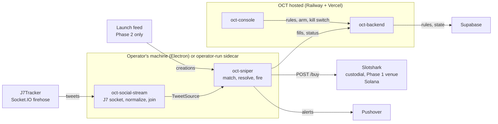
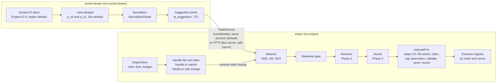

A snipe rule says "if one of these accounts posts text matching this pattern, buy
this token, this size, within this window." Two new workspaces implement it: a
**social-stream** service that holds the tweet firehose, and a **sniper** service
that matches tweets against rules and fires.

The target is **under 500 ms** from tweet frame to transaction submitted. Under
1 s is acceptable; 2–3 s means the system is overloaded. That number is not a
goal here, it is a constraint — it disqualifies specific data sources by
arithmetic, and those exclusions are the most load-bearing content on this page.

This system deliberately does **not** decide what is worth buying. It executes an
operator's pre-declared rule. Where Phase 2 has to choose between candidates, the
scoring weights ship unset and a rule with unset weights cannot arm.

## Scope and phasing

The phases look similar and are not. The difference is *when the target is bound*.

| | Phase 1 | Phase 2 | Phase 3 |
| --- | --- | --- | --- |
| Target mint | **bound at rule-creation time** — the operator types it | **resolved at trigger time** from a candidate set | unchanged |
| Candidate discovery | none | required — a whole subsystem | unchanged |
| Launch feed needed | — | ✔ (for new launches only) | — |
| Scoring function | — | ✔ (and it can be farmed) | — |
| New in this phase | matcher, risk gate, executors | resolver, scorer, launch feed | NL → rule compiler |

Phase 1 is a matcher wired to an executor. Phase 2 adds target resolution, which
is where all the genuine difficulty lives — see
[Phase 2: target resolution](../sniper-phase2/). Phase 3 compiles natural
language into a rule the operator approves; the model is never in the execution
path.

## System context

Notes that make this diagram honest:

- **Under the recommended topology the sniper and its J7 socket run on the
  operator's machine.** Only rules, status and fills cross into hosted OCT. That is
  a security decision, not a deployment convenience — see
  [sniper security](../sniper-security/) and
  [ADR-011](../../adr/011-sniper-custody/).
- The J7 JWT is **operator-supplied**. Login is Cloudflare Turnstile-gated, so it
  is pasted in by hand and re-pasted when it expires. Nothing automates that.
- **Phase 1 ships one venue: Slotshark, Solana, custodial.** The wallet is bound
  to the API credential and the venue builds, signs and submits server-side, so
  OCT holds no wallet key and there is no signer box to run
  ([ADR-011](../../adr/011-sniper-custody/)).
- **GMGN is deliberately NOT a Phase 1 execution venue.** OCT already holds a
  `GMGN_API_KEY`, but it is the **operator's** key, provisioned for enrichment and
  market data (`utils/gmgnClient.ts`). Wiring it as a trading credential would
  execute every user's snipes on the operator's own GMGN account — commingled
  funds and a custody problem in one step. GMGN trading, when it lands, arrives as
  a **per-user connected credential** ([ADR-012](../../adr/012-venue-tenancy/)),
  never a shared server-side key. The `Venue` union in `backend/src/sniper/types.ts`
  omits it so no code path can reach the operator key.

## Container view

Notes:

- **social-stream and sniper are two npm workspaces but one OS process by
  default.** The boxes are a module boundary, not a deployment boundary. The
  split is a config decision — `RemoteTweetSource` selected by env presence,
  exactly as `ensureSharedFomoClient()` swaps `FomoClient` for
  `FomoProxyClient` ([fomo-worker](../fomo-worker/)).
- **The fan-out index lives in the sniper, not social-stream.** social-stream is
  a rule-agnostic firehose; it has no way to learn about rules and needs none.
  The index is `RULE_HANDLES` loaded as `Map<handle, ruleId[]>`.
- **The risk gate is not a separate component.** Its checks are steps of
  `executeFire`, because a control that lives anywhere else can be routed
  around. See [execution](../sniper-execution/).

### Transport between the two services

| Option | Cost per hop | Precedent in this repo | Verdict |
| --- | --- | --- | --- |
| In-process `EventEmitter` | ~0 | `telegram/clientManager.ts` | ✔ default |
| HTTP + shared secret | 1–5 ms local, 20–80 ms across hosts | `fomo/proxy-client.ts` (`FOMO_WORKER_SECRET`) | ✔ opt-in when split |
| Backend `/ws` | reconnect + auth frame | `ws/server.ts` is a server for browsers — but the outbound-client precedent exists in `discord/gateway.ts` (`import WebSocket from 'ws'`, heartbeat, resume, backoff) | — for this seam |
| Supabase as a bus | 30–150 ms | none — `fomo/dispatch.ts` writes durably then fans out over `ws/server.ts`; Supabase is never an inter-process transport here, and Realtime is deliberately unused | — |

## Latency budget

Nothing in this table is measured. It is an allocation against the 500 ms target,
to be replaced with real numbers by Milestone M2.

| # | Hop | Allotment | Notes |
| --- | --- | --- | --- |
| 1 | J7 → our socket | 50–150 ms | vendor path, not ours; region failover is the only dial |
| 2 | Engine.IO parse + lane dedupe | under 5 ms | in-memory |
| 3 | Lineage join window | 150 ms | **buys idempotency correctness — see below** |
| 4 | Normalize | under 5 ms | pure |
| 5 | Fan-out index lookup | under 1 ms | `Map` |
| 6 | Matcher (AND/OR/NOT over N rules) | under 5 ms | pure; regex bounded |
| 7 | Staleness gate | under 1 ms | clock only |
| 8 | `executeFire` steps 0–2 | 5–20 ms | one DB round trip, local Postgres or JSON |
| 9 | Executor HTTP (`POST /buy`) | 80–250 ms | vendor |
| 10 | Land | outside budget | not ours |

Phase 2 inserts resolution between 7 and 8 and spends `resolution.deadlineMs`,
which the operator sets. **Phase 2 cannot meet the 500 ms target and is not
expected to** — its clock starts when the tweet lands, same as everyone's.

### The governing rule

**Any signal that cannot be obtained inside its allotment is disqualified from
the hot path by construction.** Two concrete casualties:

- **Live market cap as an abort condition.** The rule spec has a `mcapCeiling`,
  and the only market-cap source in this repo is the GMGN *enrichment* client
  (`utils/gmgnClient.ts`), which is rate-limited. Re-reading it before every retry
  attempt would put a throttled network call inside the retry loop. Resolution:
  the ceiling is evaluated against a value **pushed** by the launch feed or the
  enrichment cache, never fetched inline; if no fresh value exists the ceiling does
  not block, and the time budget alone terminates the fire. Stated explicitly so
  nobody implements the naive version.
- **Token safety checks.** Honeypot / authority / LP-lock services (GoPlus,
  honeypot.is) advertise seconds, not milliseconds. They cannot run inline before a
  fire. They belong to Phase 2 candidate pre-screening, out of band, or to an
  operator's own risk appetite at a low cap.

Any venue whose API is rate-limited per key on the order of seconds is disqualified
the same way. That is a live constraint for future venues, not a hypothetical: it is
why GMGN's cooperation router (one call per 5 s, and a fire needs route + submit +
status) would never be a fire path even when GMGN execution lands as a per-user
venue at M11.

The 150 ms join window at hop 3 deserves its own note. J7 emits the same tweet on
two provider lanes with no ordering guarantee, and only the enriched lane carries
retweet lineage. Firing on first-arrival double-fires when the lean lane wins the
race. Holding 150 ms to resolve lineage is the cost of correctness — see
[idempotency](../sniper-rules/#idempotency-and-the-double-fire-hazard).

## Reuse map

Detail in [sniper execution](../sniper-execution/) and
[sniper security](../sniper-security/). Summary:

| Reuse as-is | Extend | Copy the pattern | Avoid |
| --- | --- | --- | --- |
| `auth/encryption.ts` (AES-256-GCM), `utils/contract.ts` detectors | `packages/shared` `KeywordPattern` → AND/OR/NOT groups; `MessageSource` unchanged (tweets never become `FrontendMessage`) | `telegram/clientManager.ts` dedupe window; `discord/gateway.ts` outbound WS heartbeat and backoff (drop the resume half — J7 has none); `fomo/poller.ts` dedupe-across-subscribers | Extending `StorageProvider` — its 20-method surface is Discord/Telegram/contract-shaped; `SniperStore` is a sibling |

`utils/gmgnSigner.ts` and `utils/gmgnLimiter.ts` are **not** Phase 1 reuse — GMGN is
not a Phase 1 venue. They become relevant at M11, when a user's own GMGN credential
is the thing being signed with.

This is greenfield. A repo-wide grep for `sniper|slotshark|j7tracker|tweet`
returns three incidental hits: a `.gitignore` comment about tweet drafts, and the
`alpha_sniper` placeholder username in the landing mockup
(`landing/src/components/Hero.tsx`, `landing/src/components/landing/EnterSection.tsx`).

## Milestones

Each one is testable and proves something specific.

| # | Milestone | Proves |
| --- | --- | --- |
| M1 | Fire path against `OCT_SNIPER_DRY_RUN=1`, no funded wallet, dry-run executor only | the whole fire path, risk gate included, with no money at risk |
| M2 | J7 socket in shadow mode: log every tweet, fire nothing | real hop latencies replace the table above; lane-reversal frequency measured |
| M3 | Slotshark executor live on a minimally funded wallet, Solana | the custodial fire path end-to-end, and Slotshark's error taxonomy built empirically rather than guessed |
| M4 | Risk gate adversarial tests: ladder, multi-wallet, day rollover, restart replay | the caps actually bind — the tests are listed in [execution](../sniper-execution/) |
| M5 | Per-user venue-account connect flow (hosted): user links their own Slotshark account, token into Vault | multi-tenant execution over users' own accounts, never the operator's — [ADR-012](../../adr/012-venue-tenancy/) |
| M6 | Latency probe: real tweet → fill measured on live fires | whether the venue can hold the 500 ms budget — **gates any hot-path or sub-second commitment (M10–M11)** |
| M7 | Slotshark scoped-token adoption, once the custom OAuth integration ships | bounds threat T3 from total drain to a bad buy — the highest-leverage security win available |
| M8 | Launch feed shadow harness: log tweet → creation-arrival delta and coverage | which feed to buy, on evidence |
| M9 | Phase 2 resolution in shadow mode: persist `CANDIDATE_TOKENS`, select, fire nothing | whether the scorer picks what the operator would have |
| M10 | Phase 2 live at a structurally lower cap | — |
| M11 | GMGN as a **per-user connected** venue: users add their own GMGN credential, EVM/BSC leg behind it | multi-chain execution without the operator's key ever being a trading credential |

## Open questions

1. **RESOLVED — custody.** The Phase 1 venue is custodial: the wallet is bound to
   the API credential and Slotshark builds, signs and submits server-side, so OCT
   holds no wallet private key and there is no signer to build. See
   [ADR-011](../../adr/011-sniper-custody/).
2. **Real venue latency is unmeasured.** Slotshark's `under 1 ms` is vendor
   marketing for transaction-build time, not end-to-end tweet → fill. The venue does
   not enter the hot path on faith — M6 measures it before any sub-second commitment.
3. **Maximum hot balance — the load-bearing control.** A leaked Slotshark token can
   **sell every position and withdraw the balance** (confirmed; no buy-only scope,
   no withdrawal 2FA — [security T3](../sniper-security/)), so the funded balance
   *is* the blast radius. A defined maximum hot balance bounds nearly every
   residual-risk cell in the threat model.
4. **Slotshark scoped tokens — the highest-leverage security ask.** A buy/sell-only
   token with withdrawals disabled or 2FA-gated would collapse T3 from *total drain*
   to *a bad buy*. Offered as part of a custom OAuth integration, gated on volume
   ([ADR-012](../../adr/012-venue-tenancy/)). No encryption choice substitutes for it.
5. **GMGN third-party-user ToS — gates M11, not Phase 1.** Whether OCT may execute
   trades on behalf of its end users, or whether that needs a separate commercial
   agreement, could not be verified (their `tos.html` returned 403). Relevant only
   when GMGN returns as a per-user connected venue.
6. Does the token catalog gate on hosted mode block Phase 2a in local mode?
   `getCatalogEntry` and `upsertCatalogFromEnrichment` both open with
   `if (!isHostedMode()) return`. Lift it or document the limitation.
7. Is there a J7 frame to add or remove a watched handle? If not, handle dedupe
   is a local filter over the reverse index, not an upstream subscription.
8. Do we accept content-hash dedupe suppressing two legitimate fires when two
   watched handles post identical text? See
   [idempotency](../sniper-rules/#idempotency-and-the-double-fire-hazard).
9. **Multi-tenant onboarding is venue-gated.** Per [ADR-012](../../adr/012-venue-tenancy/),
   users connect their own venue accounts; OCT never runs a shared operator wallet.
   Broad onboarding waits on two partnership answers — GMGN's third-party ToS (2) and
   Slotshark's scoped-OAuth custom integration (offered at ~50k daily volume). Until
   then, raw sell+withdraw Slotshark tokens are **not** mass-onboarded — GMGN's
   contained token is the preferred multi-tenant execution default.
