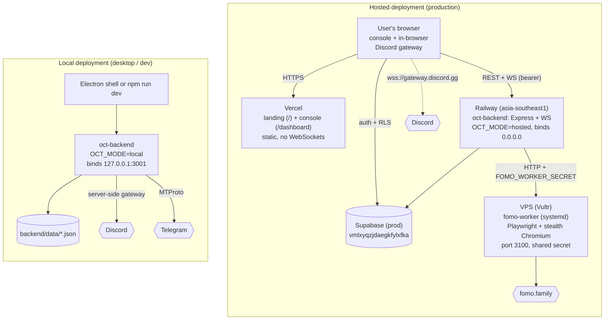

Almost every conditional in this codebase keys off **local vs hosted mode**.
Internalize this table and the rest of the system follows.

| | **Local** (`OCT_MODE=local`, default) | **Hosted** (`OCT_MODE=hosted`) |
| --- | --- | --- |
| Users | one implicit user (`userId = 'local'`) | many; Supabase-verified `userId` per request |
| Storage | JSON files in `backend/data/` | Supabase (Postgres) with RLS |
| Auth | none | Supabase bearer token (REST + WS) |
| Discord gateway | one global connection **on the server** | runs **in the browser** — token never hits the server |
| Telegram / gateways | single global manager | per-user pool with 30-min idle eviction |
| Token storage | plaintext JSON | AES-256-GCM encrypted at rest |
| Network bind | `127.0.0.1` (loopback) | `0.0.0.0` (Railway) |
| Middleware | open CORS, no limits | CORS allow-list, helmet, rate limits, `trust proxy` |
| Used by | desktop app, local dev | Railway + Vercel deployment |

The switch is read in exactly two places:

- **Backend**: `isHostedMode()` in `backend/src/storage/index.ts`
  (`OCT_MODE`/`TRENCHCORD_MODE === 'hosted'`).
- **Frontend**: `isHostedMode` / `isClientGatewayMode()`, both derived from
  `VITE_SUPABASE_URL` being set (`frontend/src/lib/supabase.ts`,
  `frontend/src/discord/clientGateway.ts`). **Hosted mode and
  browser-Discord-gateway mode are the same deployment mode.**

## Deployment diagram

## Consequences you must not break

1. **Local mode binds loopback for a reason.** No auth + an API that serves
   Discord tokens and Telegram session strings. `OCT_HOST` overrides the bind
   — don't widen it without adding authentication
   ([ADR-008](../../adr/008-local-loopback/)).
2. **Never clobber injected secrets.** `index.ts` loads `.env` with
   `override: false` so Railway/Vercel-injected vars win.
3. **WebSockets don't run on Vercel.** `VITE_API_URL` must point at Railway.
4. **Dual env branding.** Vars are read as `OCT_*` with `TRENCHCORD_*`
   fallbacks (the project was renamed from "Trenchcord") — keep both when
   touching env reads.
5. **The frontend treats `VITE_SUPABASE_URL` as the mode switch.** Setting it
   turns on hosted behavior (auth screens, browser gateway) everywhere.
   `lib/supabase.ts` also throws at import if any `VITE_SUPABASE_SERVICE*`
   key is present — a guard against leaking the service role to browsers.

## Startup order (backend)

`bootstrap.ts` (preflight dependency check) → `index.ts`:

1. env load (`override: false`)
2. Express middleware (hosted-only hardening)
3. HTTP server + `WsServer` at `/ws`
4. `/api` routes
5. `listen(3001)` (host per mode)
6. `startFomoPoller` → `startMissedRunnerPoller` → `startTokenPeakSampler` → `startBot`
7. local mode only: auto-connect Discord/Telegram from stored config

Background subsystems self-gate on their env (Supabase presence,
`GMGN_API_KEY`, `DISCORD_BOT_TOKEN`, …), so the server runs cleanly with any
subset configured.
