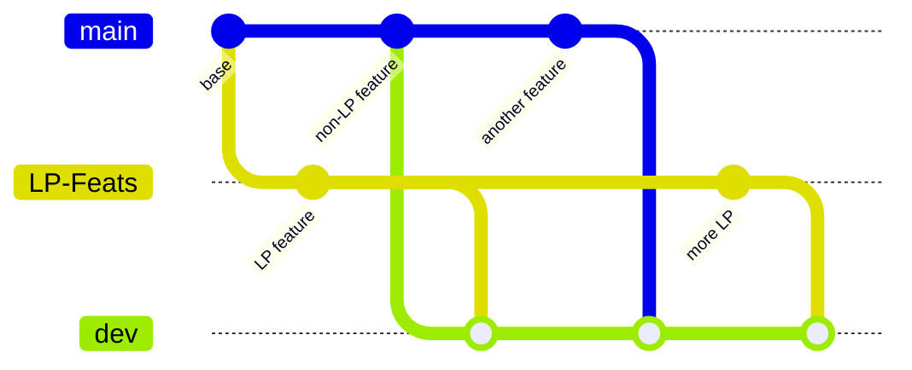

Three long-lived branches. **`dev` is an integration branch that nothing
merges out of** — it exists to prove the two halves still compose. Full
rationale in [ADR-009](../../adr/009-branch-topology/).



| Branch | Contains | Deploys |
| --- | --- | --- |
| `main` | production code, **no LP** | Railway (backend) + Vercel (frontend/landing) |
| `LP-Feats` | lp-automation + LP dashboard only | nowhere (CI only) |
| `dev` | everything (`main` ∪ `LP-Feats`) | nowhere (CI only) |

## The rules

1. **Non-LP feature** → PR into `main` → then merge `main` down into `dev`.
2. **LP feature** → PR into `LP-Feats` → then merge `LP-Feats` down into `dev`.
3. **Never merge `dev` into `main`.** It would drag `lp-automation/` back
   into production. The old `feature → dev → main` promotion flow no longer
   applies.
4. **No direct pushes to `main`** — PR + green CI first (branch protection).

## Before finishing any change

```bash
npm run typecheck
```

```bash
npm run test
```

Plus the relevant `build`. Update `IDEAS.md` when scoping features and
`CHANGELOG.md` when shipping (which also
[announces to Discord](../../operations/announcements/) — and the in-app
modal needs `frontend/src/data/updates.ts` updated too).
