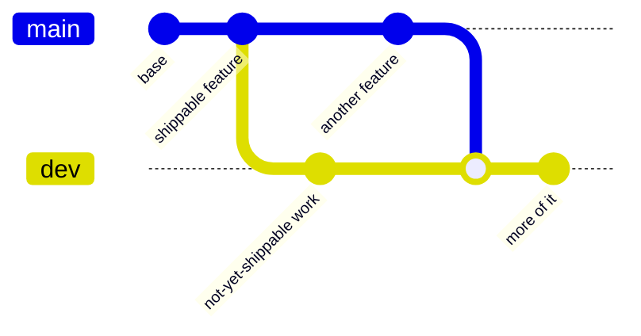

Two long-lived branches. **`dev` is an integration branch that nothing merges
out of** — it exists to prove production and the not-yet-shipped work still
compose. Full rationale in [ADR-009](../../adr/009-branch-topology/).



| Branch | Contains | Deploys |
| --- | --- | --- |
| `main` | production code — everything on it is meant to deploy | Railway (backend) + Vercel (frontend/landing) |
| `dev` | `main` plus work that is not ready to deploy | nowhere (CI only) |

The split is by **intent, not by feature list**. Features cross it as they ship,
so naming them here would age badly. As of 2026-08-07 the only thing held back on
`dev` is **LP automation** (`lp-automation/`, its dashboard page, its `/api/lp`
routes, its Foundry CI job). The **sniper is not** — it shipped to `main` and is
live in the console; see [the sniper docs](../../architecture/sniper/).

## The rules

1. **Production feature** → PR into `main` → then merge `main` down into `dev`.
2. **Work that must not deploy yet** → branch off `dev`, PR back into `dev`. It
   never reaches `main` until it is ready to ship, at which point it goes through
   rule 1 like anything else.
3. **Never merge `dev` into `main`.** It would push whatever `dev` is holding
   into production. The old `feature → dev → main` promotion flow no longer
   applies.
4. **No direct pushes to `main`** — PR + green CI first (branch protection).

## Merging `main` down into `dev`

A merge in this direction can **delete files silently**. A revert on `main`
removes files that `dev` still has, and because the two sides never edited the
same lines, git applies the deletion with no conflict to warn you.

That bit `backend/src/sniper/` between #55 (the revert on `main`) and #79 (the
module's return): every `main` → `dev` merge in that window dropped 26 files from
`dev`. **That specific hazard is gone** — the sniper ships from `main` now — but
the shape recurs. After any `main` → `dev` merge, check that what `dev` uniquely
holds still exists, and restore it from the pre-merge commit if not. See
[ADR-009](../../adr/009-branch-topology/).

## Before finishing any change

```bash
npm run typecheck
```

```bash
npm run test
```

Plus the relevant `build`. Update the [Roadmap](../../roadmap/) when scoping
features and `CHANGELOG.md` when shipping (which also
[announces to Discord](../../operations/announcements/) — and the in-app
modal needs `frontend/src/data/updates.ts` updated too).
