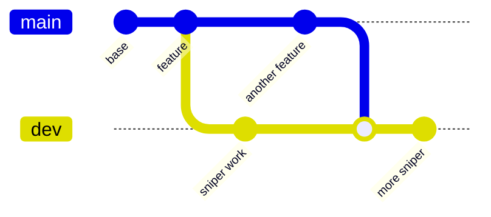

Two long-lived branches. **`dev` is an integration branch that nothing merges
out of** — it exists to prove production and the not-yet-shipped work still
compose. Full rationale in [ADR-009](../../adr/009-branch-topology/).



| Branch | Contains | Deploys |
| --- | --- | --- |
| `main` | production code, **no sniper** | Railway (backend) + Vercel (frontend/landing) |
| `dev` | everything (`main` ∪ sniper) | nowhere (CI only) |

## The rules

1. **Production feature** → PR into `main` → then merge `main` down into `dev`.
2. **Sniper work** → branch off `dev`, PR back into `dev`. It never
   reaches `main`.
3. **Never merge `dev` into `main`.** It would drag the sniper into production.
   The old `feature → dev → main` promotion flow no longer applies.
4. **No direct pushes to `main`** — PR + green CI first (branch protection).

## Merging `main` down into `dev`

`main` reverted the dormant sniper in #55. Merging `main` into `dev` therefore
*deletes the sniper module from `dev`* — silently, with no conflict, because
the two sides never edit the same lines. After any `main` → `dev` merge, check
that `backend/src/sniper/` survived and restore it from the pre-merge commit if
not. See [ADR-009](../../adr/009-branch-topology/).

## Before finishing any change

```bash
npm run typecheck
```

```bash
npm run test
```

Plus the relevant `build`. Update the [Roadmap](../../roadmap/) when scoping
features and `CHANGELOG.md` when shipping (which also
[announces to Discord](../../operations/announcements/) — and the in-app
modal needs `frontend/src/data/updates.ts` updated too).
