Hosted mode persists to Supabase Postgres. 13 migrations in
`supabase/migrations/` produce **20 live tables** in schema `public`. Local
mode mirrors a subset of this into JSON files — see
[Storage abstraction](../storage/).

## Entity-relationship diagram

```mermaid
erDiagram
  AUTH_USERS ||--o| USER_CONFIGS : "user_id"
  AUTH_USERS ||--o{ DISCORD_TOKENS : "user_id"
  AUTH_USERS ||--o{ ROOMS : "user_id"
  AUTH_USERS ||--o{ ROOM_CHANNELS : "user_id"
  AUTH_USERS ||--o{ HIGHLIGHTED_USERS : "user_id"
  AUTH_USERS ||--o{ KEYWORDS : "user_id"
  AUTH_USERS ||--o{ CONTRACTS : "user_id"
  AUTH_USERS ||--o{ USER_SOUNDS : "user_id"
  AUTH_USERS ||--o| TELEGRAM_CREDENTIALS : "user_id"
  AUTH_USERS ||--o{ TELEGRAM_SESSIONS : "user_id"
  AUTH_USERS ||--o{ USER_TRACKED_WALLETS : "user_id"
  AUTH_USERS ||--o{ USER_HOLDING_WALLETS : "user_id"
  AUTH_USERS ||--o{ MISSED_RUNNER_ALERTS : "user_id"
  AUTH_USERS ||--o{ FOMO_TRACKED_USERS : "user_id"
  AUTH_USERS ||--o{ FOMO_TRADE_DELIVERIES : "user_id"
  AUTH_USERS ||--o{ LP_AUTOMATION_POLICIES : "user_id"
  ROOMS ||--o{ ROOM_CHANNELS : "room_id"
  ROOMS ||--o{ HIGHLIGHTED_USERS : "room_id (null = global)"
  ROOMS ||--o{ KEYWORDS : "room_id (null = global)"
  FOMO_TRADE_EVENTS ||--o{ FOMO_TRADE_DELIVERIES : "trade_event_id"

  TOKEN_CATALOG {
    text address
    text chain
    text evm_chain
    numeric fdv
    timestamptz enriched_at
  }
  TOKEN_PEAKS {
    text address
    text chain
    numeric peak_mc
    timestamptz peak_at
  }
  FOMO_POLL_STATE {
    boolean id PK "singleton (only true)"
    text last_trade_id
    text refresh_token
  }
  FOMO_ACTIVITY_CURSORS {
    text fomo_user_id PK
    text last_activity_id
  }
```

Reading notes:

- `AUTH_USERS` is Supabase's `auth.users` (outside `public`); every FK to it
  is `ON DELETE CASCADE`.
- `user_configs` and `telegram_credentials` are one-per-user (`unique(user_id)`).
- `highlighted_users.room_id` and `keywords.room_id` are **nullable** — null
  means a global (non-room) entry.
- The four standalone entities at the bottom have **no FKs at all** — they are
  global caches/cursors joined in application code, not SQL. Similarly,
  `contracts.room_ids` is a `text[]` (not FKs to `rooms`), and
  `fomo_trade_events.fomo_user_id` joins to `fomo_tracked_users.fomo_user_id`
  as plain text.

## Table groups

### Per-user configuration

| Table | Purpose | Key constraints |
| --- | --- | --- |
| `user_configs` | Everything-else settings as one JSONB blob (`settings`) | `unique(user_id)` |
| `discord_tokens` | AES-256-GCM encrypted Discord tokens (`encrypted_token` + `token_iv` + `token_tag` + `token_mask`), ordered by `position` | — |
| `telegram_credentials` | Encrypted Telegram API id + hash | `unique(user_id)` |
| `telegram_sessions` | Encrypted MTProto session strings, ordered by `position` | — |
| `rooms` | Console rooms: `name`, `color`, `filtered_users text[]`, `filter_enabled`, `highlight_mode`, `position` | — |
| `room_channels` | Channels in a room: `source` (`discord`/`telegram`), `guild_id`, `channel_id`, names, `disable_embeds`. `user_id` denormalized for RLS | — |
| `highlighted_users` | Highlight rules; `match_type` in `('user_id','username')` | `unique(user_id, room_id, match_type, value)` |
| `keywords` | Keyword alerts; `match_mode` in `('includes','exact','regex')` | `unique(user_id, room_id, pattern, match_mode)` |
| `user_sounds` | Pointers into the Supabase Storage `sounds` bucket per `sound_type`/`channel_id` | — |

### Feed data

| Table | Purpose | Key constraints |
| --- | --- | --- |
| `contracts` | Append-only contract call log: detection fields (address, chain, author, channel, room_ids, message, timestamp, `first_seen`) plus 14 enrichment columns (`token_name`, `token_symbol`, `fdv_at_call`, `liquidity_usd`, `volume_usd`, `price_usd`, `token_age`, `enrichment_source`, `enriched_at`, …) | append-only; no unique key |
| `token_catalog` | **Global** token metadata cache (5-minute staleness window) shared across tenants | `unique(address, chain, evm_chain)` — `evm_chain` defaults `''` so it can sit in the key |
| `token_peaks` | **Global** high-water market cap per token; input to caller-quality scoring | `unique(address, chain)` — `evm_chain` deliberately excluded |

### Wallets & alerts

| Table | Purpose | Key constraints |
| --- | --- | --- |
| `user_tracked_wallets` | Whale watchlist: `chain` in `('bsc','ethereum','solana','base','robinhood')`, display fields, per-surface alert toggles | `unique(user_id, chain, address)` |
| `user_holding_wallets` | Wallets the user trades from — missed-runner balance checks | `unique(user_id, chain, address)` |
| `missed_runner_alerts` | Dedupe/cooldown ledger for missed-runner alerts (`cooldown_until`, `mc_at_call`, `mc_now`, `multiplier`) | **unique** `(user_id, lower(token_address))` |

### FOMO (fomo.family)

| Table | Purpose | Key constraints |
| --- | --- | --- |
| `fomo_tracked_users` | Which FOMO traders each OCT user follows; drives the reverse fan-out | `unique(user_id, fomo_user_id)` |
| `fomo_trade_events` | Store-once log of dispatched trades (raw payload in `raw jsonb`) | partial unique on `trade_id` — code relies on `23505` for idempotent insert |
| `fomo_trade_deliveries` | Which OCT user received which event; powers the 24 h replay | `unique(trade_event_id, user_id)` |
| `fomo_activity_cursors` | Global poll progress per FOMO trader | PK `fomo_user_id` (text) |
| `fomo_poll_state` | Singleton: global poll cursor + the **rotating Privy refresh token** | PK `id boolean` with `CHECK (id)` — at most one row |

### LP automation

`lp_automation_policies` exists in the migration set even on `main` (prod
already has the table, and main's migrations must describe the database it
deploys to — the LP *code* lives on `dev`). It is versioned and
append-only: a trigger rejects any UPDATE that changes anything besides
`is_active`, and a partial unique index enforces one active version per user.

## Row-level security

Every table has RLS enabled. The backend's service-role key bypasses RLS for
poller/fan-out work; browser clients go through these policies:

- **Own-rows CRUD** (`auth.uid() = user_id`, all operations): all per-user
  config tables, `contracts`, `user_tracked_wallets`, `user_holding_wallets`,
  `fomo_tracked_users`.
- **Admin read-through**: `user_tracked_wallets` and `fomo_tracked_users` add
  a `SELECT` policy for JWTs with `app_metadata.role = 'admin'`.
- **Owner read-only**: `missed_runner_alerts` — users can only `SELECT` their
  own; the poller writes with the service role.
- **Read + append, never modify**: `lp_automation_policies` — browsers can
  read and append versions; retiring a version goes through the
  `SECURITY DEFINER` function `lp_append_policy` (service-role only).
- **Deny-all (service-role only)**: `fomo_trade_events`, `fomo_poll_state`,
  `fomo_activity_cursors`, `fomo_trade_deliveries`, `token_catalog`,
  `token_peaks` — RLS enabled with zero policies.

Notable functions: `oct_user_id_by_discord_id(text)` (`SECURITY DEFINER`,
service-role only) maps a Discord user id to an OCT user via
`auth.identities` — this is how the OCT bot resolves tenancy.

## Two Supabase projects

| Env | Project ref | Used by |
| --- | --- | --- |
| dev | `zcvubfadvdwjxgodznxh` | local hosted-mode testing |
| prod | `vmlxyqzjdaegkfylxfka` | Railway deployment |

Verify migrations against the right one before applying.

:::note[Known staleness]
`supabase/database.types.ts` is ~10 migrations behind: it omits the wallet,
FOMO, catalog/peaks, and LP tables, misses the 14 `contracts` enrichment
columns, and still declares the dropped `wallets` table. Newer code
compensates by using untyped Supabase clients. Regenerating it (and deleting
the `wallets` block) is an open chore.
:::
