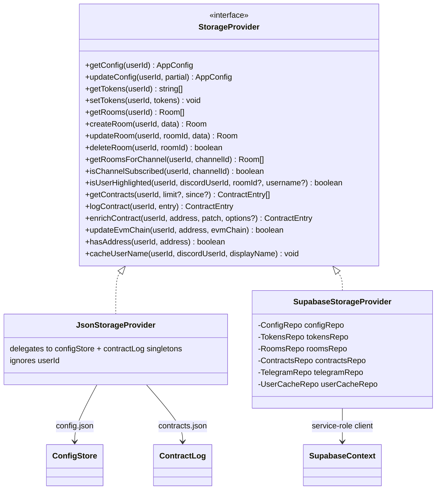

All *user-scoped* persistence goes through one interface so the rest of the
backend never knows which mode it is in.

## Class diagram

Selection happens once, in `backend/src/storage/index.ts`:
`getStorageProvider()` memoizes the implementation chosen by `isHostedMode()`
(`OCT_MODE`/`TRENCHCORD_MODE === 'hosted'`). **New user-scoped persistence
should go through this interface**, not directly to Supabase or the JSON
store.

Every method takes `userId` first. The JSON provider ignores it (local mode
has exactly one user, `'local'`); the Supabase provider scopes every query
with it.

## What deliberately bypasses the interface

The wallet, FOMO, token-catalog, token-peak, and missed-runner
tables talk to Supabase through their own service clients
(`backend/src/fomo/store.ts`, `storage/tokenCatalog.ts`,
`alerts/tokenPeakStore.ts`). This is intentional: those tables are
hosted-only and partly service-role-only (RLS deny-all), so a local-mode
implementation would be dead code. The one exception is `token_peaks`, which
got a local JSON mirror (`token-peaks.json`) so the **desktop app can still
score callers**.

## Local mode: files under `backend/data/`

| File | Holds | Hosted equivalent |
| --- | --- | --- |
| `config.json` | The entire `AppConfig` as one document | Fans out to `user_configs.settings` + `discord_tokens` + `rooms`/`room_channels` + `highlighted_users` + `keywords` + `telegram_credentials`/`telegram_sessions` |
| `config.default.json` | Checked-in first-run seed (placeholder room ids get fresh UUIDs) | — |
| `contracts.json` | `ContractEntry[]`, newest first, hard-capped at 2000 | `contracts` (uncapped) |
| `token-peaks.json` | `Record<address, TokenPeak>` | `token_peaks` |
| `sounds/` | Uploaded alert audio | Supabase Storage `sounds` bucket + `user_sounds` |

Data dir resolution: `OCT_DATA_DIR` → `TRENCHCORD_DATA_DIR` → `backend/data`.

### The `config.json` → table decomposition

Local mode stores one blob; the Supabase provider splits it. Highlights of
the mapping (`storage/supabase/mappers.ts`):

- `discordTokens: string[]` → `discord_tokens` rows, AES-256-GCM encrypted,
  `position` preserves order.
- `rooms[].channels` → `room_channels`; `rooms[].highlightedUsers` →
  `highlighted_users` (a leading `@` becomes `match_type='username'`);
  `rooms[].keywordPatterns` → `keywords`.
- `globalHighlightedUsers` / `globalKeywordPatterns` → same tables with
  `room_id = NULL`.
- `telegramApiId/ApiHash/Sessions` → encrypted tables, and **scrubbed** from
  the `settings` JSONB on both read and write.
- Everything else (`pushover`, `missedRunner`, sounds config, layout, caller
  tiers, …) stays verbatim inside `user_configs.settings`.

### Behavioral differences worth knowing

- **Retention**: local truncates `contracts.json` to 2000 entries on every
  write; hosted has no cap.
- **`first_seen`**: local computes it against its 2000-row window; hosted
  computes it per user across the whole table.
- **Enrichment carry-forward**: hosted `logContract` back-fills token metadata
  from the most recent enriched row for the same address; local has no
  equivalent.

## Token catalog

`storage/tokenCatalog.ts` maintains the **global** (cross-tenant)
`token_catalog` cache with a 5-minute staleness window. It is hosted-only:
`getCatalogEntry` returns `null` and `upsertCatalogFromEnrichment` no-ops in
local mode. `enrichToken` in `utils/tokenSnapshot.ts` orchestrates the
GMGN → DexScreener enrichment order and persists here.
