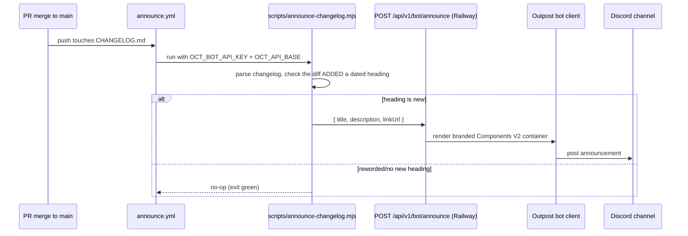

Adding a new `## <date>` section to `CHANGELOG.md` and merging it to `main`
posts that entry to the Discord announcements channel — no manual step.

Design rationale in [ADR-010](../../adr/010-event-driven-announce/): event-
driven, not scheduled — a cron would double-post or miss, and rewording a
shipped entry must not re-announce it.

## Operating it

- **Preview**: Actions → Announce → run with `dry_run` — prints the payload,
  posts nothing.
- **Backfill**: run with `force` to announce an entry that isn't new in the
  push.
- **DMs**: release-notes DMs to opted-in users only happen on a deliberate
  manual run with `--dm`; pushes can never DM. Recipients are capped (2000)
  and walked sequentially with rate-limit handling.
- **Release-notes drafts**: `draft-release-notes.yml` fires when a PR merges
  to `main` and asks the routine to draft notes — a human accepts before
  anything is announced.

## Requirements

- Repo secrets `OCT_BOT_API_KEY` (same value as the backend env) and
  `OCT_API_BASE` (the Railway URL); optional repo variable
  `ANNOUNCE_LINK_URL`.
- The bot must be online in the backend the workflow calls, with
  `DISCORD_ANNOUNCE_CHANNEL_ID` set and View/Send/Embed permissions in that
  channel — otherwise the endpoint returns 503 and the run fails loudly.

## Also announced in-app

The console's announcement modal reads its own list
(`frontend/src/data/updates.ts`) — shipping a feature means updating **both**
`CHANGELOG.md` (Discord + landing changelog) and `updates.ts` (in-app modal),
ideally with a screenshot under `/updates/`.
